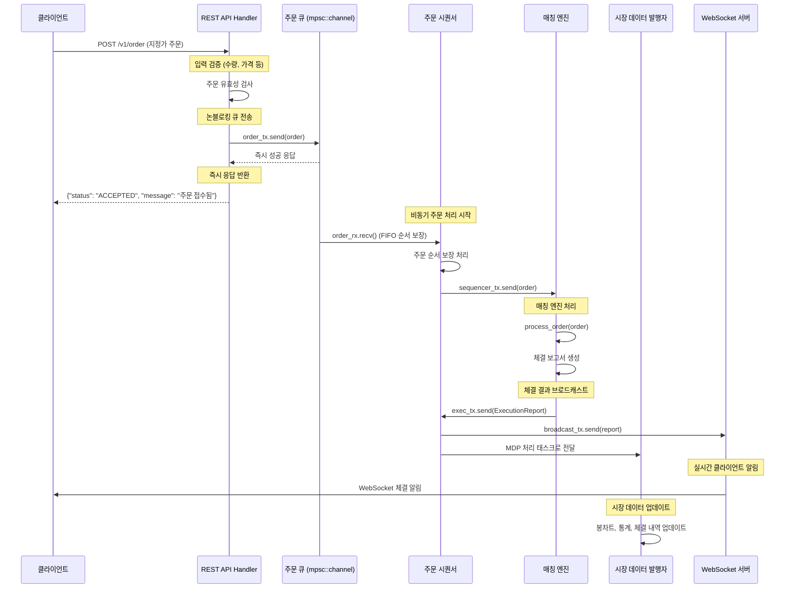
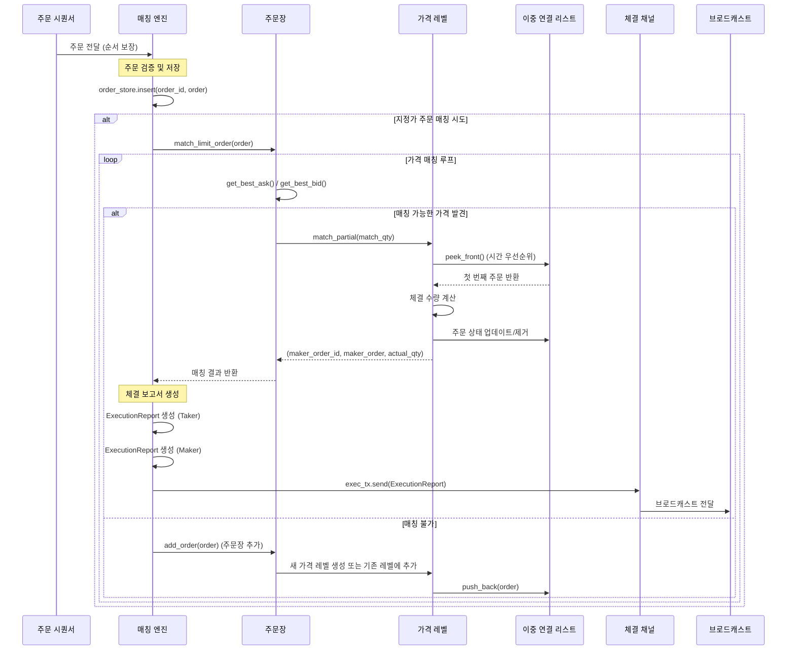
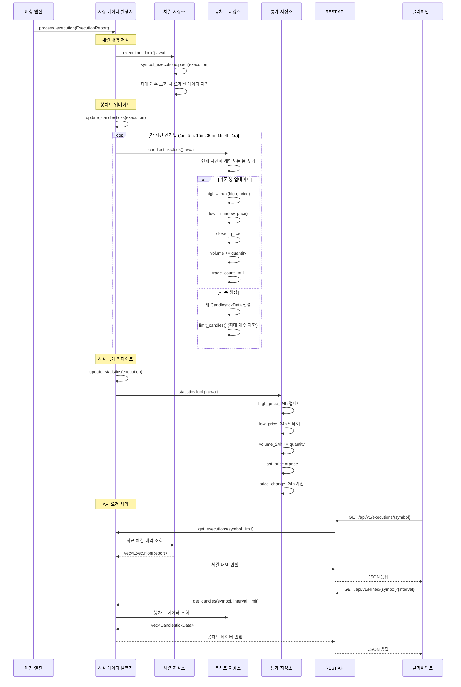
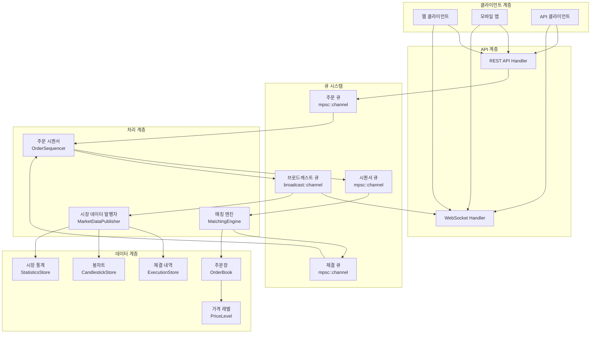

# 주문 매칭 엔진 - 최종 프로젝트 구조 (MDP)

아래는 Market Data Publisher(MDP)가 통합된 주문 매칭 엔진의 최종 프로젝트 구조입니다:

```
order-matching-engine/
│
├── Cargo.toml                 # 프로젝트 설정 및 의존성
├── Cargo.lock
├── build.rs                   # 빌드 스크립트
├── README.md                  # 프로젝트 설명 및 사용 방법
│
├── src/                       # 소스 코드
│   ├── lib.rs                 # 라이브러리 루트 모듈 및 재내보내기
│   ├── main.rs                # 애플리케이션 진입점
│   ├── models.rs              # 데이터 모델 정의 (Order, Execution, OrderBook 등)
│   ├── matching_engine.rs     # 주문 매칭 엔진 구현
│   ├── sequencer.rs           # 입력/출력 시퀀서
│   ├── order_manager.rs       # 주문 관리 API
│   │
│   ├── websocket/             # WebSocket 관련 코드 (체결 정보 알림용)
│   │   ├── mod.rs             # WebSocket 모듈 정의
│   │   └── execution_push.rs  # 체결 실시간 알림
│   │
│   ├── market_data_publisher/ # 시장 데이터 발행자 (MDP)
│   │   ├── mod.rs             # MDP 모듈 정의
│   │   ├── publisher.rs       # 주요 MDP 구현 - 오더북, 체결, 통계 관리
│   │   ├── candlestick.rs     # 봉차트 관리자
│   │   └── models.rs          # MDP 관련 데이터 모델
│   │
│   └── util/                  # 유틸리티 함수
│       ├── mod.rs             # 유틸리티 모듈 정의
│       └── serializer.rs      # 데이터 직렬화/역직렬화
│
├── tests/                     # 테스트 코드
│   ├── integration_test.rs    # 통합 테스트
│   ├── websocket_test.rs      # WebSocket 테스트
│   └── mdp_test.rs            # 시장 데이터 발행자 테스트
│
├── examples/                  # 예제 코드
│   ├── simple_client.rs       # 간단한 클라이언트 예제
│   └── order_simulation.rs    # 주문 시뮬레이션 예제
│
└── docs/                      # 문서
    ├── architecture.md        # 아키텍처 문서
    ├── api.md                 # API 명세
    └── market_data_api.md     # 시장 데이터 API 문서
```

## 주요 파일 설명

### 핵심 구조

- **lib.rs**: 라이브러리의 루트 모듈로, 다른 모듈을 외부로 노출하고 주요 구조체를 재내보냅니다.
- **main.rs**: 실행 파일의 진입점으로, 서버 시작 및 컴포넌트 초기화를 담당합니다.
- **models.rs**: 주문, 체결, 주문책 등의 기본 데이터 모델을 정의합니다.
- **matching_engine.rs**: 주문 매칭 알고리즘을 구현합니다.
- **sequencer.rs**: 주문 및 체결 처리 순서를 보장합니다.
- **order_manager.rs**: 주문 관리 REST API 엔드포인트를 제공합니다.

### WebSocket 체결 알림

- **websocket/mod.rs**: WebSocket 모듈의 진입점입니다.
- **websocket/execution_push.rs**: 체결 정보를 실시간으로 클라이언트에 푸시합니다.

### 시장 데이터 발행자 (MDP)

- **market_data_publisher/mod.rs**: MDP 모듈의 진입점입니다.
- **market_data_publisher/publisher.rs**: 오더북 상태, 체결 정보, 시장 통계 데이터를 관리하고 HTTP API를 통해 제공합니다.
- **market_data_publisher/candlestick.rs**: 체결 정보를 기반으로 다양한 시간 간격의 봉차트 데이터를 생성하고 관리합니다.
- **market_data_publisher/models.rs**: 시장 데이터 관련 모델 및 원형 버퍼 구현을 포함합니다.

### 유틸리티 및 기타

- **util/serializer.rs**: 데이터 직렬화 및 역직렬화 유틸리티를 제공합니다.
- **build.rs**: 빌드 타임 작업을 수행하는 스크립트입니다.
- **Cargo.toml**: 프로젝트 메타데이터 및 의존성을 정의합니다.

## 모듈 의존 관계

```
                         +---------------+
                         |     main      |
                         +---------------+
                                |
                 +-------------------------------+
                 |              |                |
        +----------------+      |        +----------------+
        |  order_manager |      |        |    websocket   |
        +----------------+      |        +----------------+
                |               |                |
                |        +-------------+         |
                +------->|  sequencer  |<--------+
                         +-------------+
                                |
                         +-------------+
                         |  matching   |
                         |   engine    |
                         +-------------+
                                |
                         +-------------+
                         |   models    |<---------------------+
                         +-------------+                      |
                                |                             |
                         +------------------+          +------------------+
                         | market_data_pub. |--------->|       util      |
                         +------------------+          +------------------+
```

## 주요 데이터 흐름

### 1. 주문 처리 흐름 (주요 파이프라인)

1. 클라이언트가 REST API를 통해 주문 제출
2. 주문 관리자(order_manager)가 주문을 입력 시퀀서로 전달
3. 시퀀서(sequencer)가 주문을 매칭 엔진으로 순서대로 전달
4. 매칭 엔진(matching_engine)이 주문 매칭 처리 및 체결 생성
5. 시퀀서를 통해 체결 정보가 분배:
   - WebSocket을 통해 실시간 체결 알림 푸시
   - 시장 데이터 발행자(MDP)로 전달

### 2. 시장 데이터 흐름 (MDP)

1. MDP가 매칭 엔진으로부터 오더북 상태 및 체결 정보 수신
2. 수신한 데이터를 기반으로 다양한 데이터 생성 및 관리:
   - 오더북 스냅샷: 현재 호가창 상태
   - 체결 이력: 최근 체결 내역
   - 시장 통계: 24시간 가격 변화, 거래량 등
   - 봉차트 데이터: 다양한 시간 간격(1분, 5분, 1시간 등)의 OHLCV 데이터
3. HTTP API를 통해 클라이언트에게 시장 데이터 제공

## 주요 API 엔드포인트

### 주문 관리 API

- `POST /v1/order`: 새 주문 생성
- `POST /v1/order/cancel`: 주문 취소
- `GET /v1/execution`: 체결 내역 조회

### 시장 데이터 API

- `GET /api/v1/orderbook/{symbol}`: 특정 심볼의 오더북 조회
- `GET /api/v1/executions/{symbol}`: 최근 체결 내역 조회
- `GET /api/v1/statistics/{symbol}`: 24시간 시장 통계 조회
- `GET /api/v1/klines/{symbol}/{interval}`: 봉차트 데이터 조회 (interval: 1m, 5m, 15m, 1h, 1d 등)

### WebSocket 엔드포인트

- `ws://127.0.0.1:3030/ws/executions`: 실시간 체결 정보 수신

## 매칭엔진 특징

1. **데이터 구조**:
   - **주문책(OrderBook)**: 매수와 매도 주문을 별도로 관리하는 효율적인 구조
   - **가격 레벨(PriceLevel)**: 같은 가격의 주문들을 그룹화하여 관리
   - **해시맵과 트리 맵 활용**: 빠른 조회(O(1))와 정렬된 접근(O(log n))을 모두 지원
2. **매칭 알고리즘**:
   - **가격-시간 우선순위**: 가격이 좋은 주문이 먼저 체결되고, 같은 가격은 먼저 들어온 주문이 우선
   - **즉시 매칭**: 신규 주문이 들어오면 즉시 반대편 주문책과 매칭 시도
   - **부분 체결**: 주문이 여러 번에 걸쳐 부분적으로 체결되는 경우 처리
3. **아키텍처**:
   - **시퀀서 기반**: 입력 및 출력 시퀀서를 통한 주문 및 체결의 순서 보장
   - **비동기 처리**: Tokio 기반 비동기 처리로 높은 처리량 달성
   - **채널 기반 통신**: mpsc 채널을 통한 컴포넌트 간 효율적인 통신
4. **API 제공**:
   - **REST API**: 주문 생성, 취소, 체결 조회 등의 기능 제공
   - **WebSocket 알림**: 체결 정보 실시간 푸시

### 매칭 엔진의 개선 사항

1. **알고리즘 최적화**:
   - **복합 주문 타입 지원**: 스탑 주문, IOC, FOK, 빙산 주문 등 다양한 주문 유형 구현
   - **주문 유효성 검사 강화**: 더 엄격한 주문 검증 로직으로 잘못된 주문 방지
   - **자동 오더북 재조정**: 불균형한 오더북을 자동으로 감지하고 최적화
2. **성능 향상**:
   - **병렬 처리 확대**: 심볼별 병렬 처리로 다중 심볼 처리 성능 향상
   - **배치 처리**: 여러 주문을 묶어서 처리하는 배치 처리 기능
   - **메모리 최적화**: 캐시 친화적인 데이터 구조로 변경
   - **Lock-free 알고리즘**: 더 많은 부분에 Lock-free 알고리즘 도입으로 동시성 개선
3. **안정성 및 복원력**:
   - **장애 복구 메커니즘**: 충돌 후 상태 복원 기능
   - **주문 스냅샷 및 체크포인트**: 정기적인 상태 저장 및 복구 지점 생성
   - **비상 차단 기능**: 이상 상황 감지 시 자동 중단 메커니즘
   - **주문 제한**: 특정 조건 하에서 주문 제한 기능 (서킷 브레이커, 일일 한도 등)
4. **확장성**:
   - **수평적 확장**: 여러 매칭 엔진 인스턴스로 부하 분산
   - **샤딩 전략**: 심볼별 또는 주문 범위별 샤딩으로 확장성 확보
   - **분산 아키텍처**: 완전한 분산 시스템으로 전환하여 단일 장애점 제거
   - **마이크로서비스화**: 개별 컴포넌트를 독립적인 마이크로서비스로 분리
5. **규정 준수 및 감사**:
   - **상세 감사 로그**: 모든 주문 및 체결에 대한 변경 불가능한 감사 로그
   - **규제 보고 기능**: 규제 요구사항에 맞는 보고서 자동 생성
   - **이상 거래 감지**: 불법적이거나 이상한 거래 패턴 감지 알고리즘
   - **공정한 접근 보장**: 모든 참가자에게 공정한 시장 접근 보장 메커니즘
6. **고급 기능**:
   - **수수료 구조**: 복잡한 수수료 구조 지원 (메이커/테이커, 거래량 기반 할인 등)
   - **다양한 상품 유형**: 현물 외에 파생상품, 옵션, 선물 등 지원
   - **마진 거래**: 레버리지 및 마진 요구사항 관리
   - **위험 관리**: 실시간 위험 평가 및 관리 도구
7. **테스트 및 시뮬레이션**:
   - **스트레스 테스트 강화**: 극단적인 시장 상황에서의 행동 테스트
   - **시장 시뮬레이터**: 다양한 시장 조건에서의 동작 시뮬레이션
   - **성능 벤치마킹**: 자동화된 성능 측정 및 병목 현상 감지
   - **퍼징 테스트**: 무작위 입력으로 예상치 못한 동작 감지
8. **API 및 인터페이스 개선**:
   - **GraphQL 지원**: 더 유연한 API 쿼리 지원
   - **웹훅(Webhook)**: 이벤트 기반 알림 시스템
   - **커스텀 필터링**: API 응답의 필드 선택 및 필터링 옵션
   - **배치 API**: 여러 주문을 한 번에 제출할 수 있는 배치 API
9. **보안 강화**:
   - **인증 및 권한 부여**: 강화된 인증 시스템과 세밀한 권한 관리
   - **속도 제한**: 클라이언트별 요청 제한으로 DoS 공격 방지
   - **암호화**: 민감한 데이터 암호화 및 보안 통신
   - **침입 감지**: 비정상적인 API 사용 패턴 감지


## MDP 특징

### 1. 오더북 데이터 관리

- 매칭 엔진으로부터 오더북 상태 업데이트 수신
- 각 심볼별로 최신 오더북 상태 유지
- HTTP API를 통한 오더북 스냅샷 제공

### 2. 체결 데이터 관리

- 최근 체결 내역 저장 (심볼당 최대 1000개)
- 체결 정보를 바탕으로 다양한 통계 계산
- HTTP API를 통한 체결 내역 조회

### 3. 시장 통계 계산

- 24시간 가격 변화, 최고가, 최저가, 거래량 관리
- 현재 최고 매수가, 최저 매도가 추적
- 가격 변화율 계산 및 제공

### 4. 봉차트 데이터 관리

- 원형 버퍼를 사용한 효율적인 봉차트 데이터 저장
- 다양한 시간 간격 지원: 1분, 5분, 15분, 30분, 1시간, 4시간, 1일, 1주일
- 시간 간격별 적절한 데이터 보존 기간 설정
- 실시간 봉차트 업데이트 및 완료된 봉차트 저장

### 5. HTTP API

- RESTful API를 통한 시장 데이터 제공
- 데이터 필터링 및 제한 기능 (개수 제한 등)
- 존재하지 않는 심볼에 대한 적절한 응답 처리

### 6. 확장성 고려

- 동시성 안전한 데이터 구조 사용 (Arc, Mutex)
- 제한된 메모리 사용을 위한 데이터 크기 제한
- 다양한 심볼 및 시간 간격 지원

## 원형 버퍼(Circular Buffer)

MDP의 핵심 기능 중 하나는 시계열 데이터의 효율적인 관리입니다. 특히 봉차트 데이터와 같이 시간에 따라 계속 생성되는 데이터를 관리하기 위해 원형 버퍼를 사용합니다.

원형 버퍼의 특징:

1. **고정 크기 메모리 사용**: 데이터가 계속 들어와도 메모리 사용량은 일정하게 유지
2. **FIFO(First-In-First-Out) 방식**: 가장 오래된 데이터가 새 데이터에 의해 대체됨
3. **시간 간격별 최적화**: 각 시간 간격에 적합한 버퍼 크기 설정 가능

시간 간격별 버퍼 크기:
- 1분봉: 1440개 (24시간)
- 5분봉: 1152개 (4일)
- 15분봉: 960개 (10일)
- 30분봉: 1008개 (3주)
- 1시간봉: 720개 (30일)
- 4시간봉: 720개 (120일)
- 일봉: 365개 (1년)
- 주봉: 156개 (3년)


### 현재 MDP의 개선 사항:

a. 성능 최적화:

델타 기반 오더북 업데이트: 전체 오더북 대신 변경된 부분만 전송
캐싱 계층 도입: 자주 요청되는 데이터를 캐싱하여 응답 시간 단축
병렬 처리 강화: 여러 심볼의 데이터 처리를 병렬화

b. 기능 확장:

실시간 이벤트 알림: 가격 알림, 특정 조건 충족 시 알림
더 많은 시장 지표: VWAP, 거래량 가중 평균가, 이동평균 등
호가 집계: 다양한 틱 사이즈로 호가 정보 집계 제공
거래 심볼 메타데이터: 심볼 기본 정보, 거래 가능 시간 등

c. 확장성 및 신뢰성:

다중 인스턴스 지원: 여러 MDP 인스턴스 간 데이터 동기화
영구 저장소 연동: 중요 데이터의 디스크 저장 및 복구
부하 분산 메커니즘: 트래픽 급증 시 부하 분산
장애 복구 로직: 누락된 업데이트 감지 및 복구

d. 보안 및 접근 제어:

API 접근 인증: 클라이언트 인증 및 권한 부여
속도 제한: 클라이언트별 API 호출 횟수 제한
민감 정보 필터링: 응답에서 민감한 정보 제외

e. 모니터링 및 관리:

시스템 상태 모니터링: 메모리 사용량, 처리 시간 등 모니터링
통계 수집: API 사용 패턴, 인기 데이터 등 분석
관리 도구: 시장 데이터 수동 조정 및 재계산 도구


이러한 설계를 통해 MDP는 과거 데이터를 효율적으로 관리하면서도 현재 시장 상태를 정확히 반영할 수 있습니다.

## 매칭 엔진과 MDP 상세 시퀀스 다이어그램

### 1. 논블로킹 주문 처리 시퀀스 (즉시 응답)



### 2. 매칭 엔진 내부 처리 시퀀스



### 2. MDP 데이터 처리 시퀀스



## 채널 기반 큐 시스템 및 데이터 흐름

### 1. 채널 구조 및 큐 시스템

```mermaid
graph TD
    A[클라이언트] -->|HTTP POST| B[REST API Handler]
    B -->|order_tx.send()| C[mpsc::channel Order]
    C -->|order_rx.recv()| D[주문 시퀀서]
    D -->|sequencer_tx.send()| E[mpsc::channel Order]
    E -->|sequencer_rx.recv()| F[매칭 엔진]
    F -->|exec_tx.send()| G[mpsc::channel ExecutionReport]
    G -->|exec_rx.recv()| H[시퀀서 브로드캐스트]
    H -->|broadcast_tx.send()| I[broadcast::channel]
    I -->|WebSocket| J[클라이언트들]
    H -->|MDP 처리| K[시장 데이터 발행자]
```

### 2. 채널별 역할 및 특성

#### **주문 채널 (mpsc::channel<Order>)**
```rust
let (order_tx, order_rx) = mpsc::channel::<Order>();
```
- **역할**: API → 시퀀서 간 주문 전달
- **특성**: 단일 생산자, 단일 소비자
- **용량**: 무제한 (메모리 허용 범위)
- **순서**: FIFO 보장
- **사용처**: 
  - `API Handler`: `state.order_tx.send(order)`
  - `시퀀서`: `order_rx.recv()`

#### **시퀀서 채널 (mpsc::channel<Order>)**
```rust
let (sequencer_tx, sequencer_rx) = mpsc::channel::<Order>();
```
- **역할**: 시퀀서 → 매칭 엔진 간 주문 전달
- **특성**: 순서 보장된 주문 처리
- **용량**: 무제한
- **순서**: FIFO 보장 (시퀀서에서 처리)
- **사용처**:
  - `시퀀서`: `sequencer_tx.send(order)`
  - `매칭 엔진`: `sequencer_rx.recv()`

#### **체결 보고서 채널 (mpsc::channel<ExecutionReport>)**
```rust
let (exec_tx, exec_rx) = mpsc::channel::<ExecutionReport>();
```
- **역할**: 매칭 엔진 → 시퀀서 간 체결 보고서 전달
- **특성**: 체결 결과 전달
- **용량**: 무제한
- **순서**: FIFO 보장
- **사용처**:
  - `매칭 엔진`: `self.exec_tx.send(report)`
  - `시퀀서`: `exec_rx.recv()`

#### **브로드캐스트 채널 (broadcast::channel)**
```rust
let (broadcast_tx, _broadcast_rx) = broadcast::channel(1000);
```
- **역할**: 체결 보고서를 여러 WebSocket 클라이언트에게 전달
- **특성**: 다중 생산자, 다중 소비자
- **용량**: 1000개 메시지 버퍼
- **순서**: 각 구독자별 FIFO 보장
- **사용처**:
  - `시퀀서`: `broadcast_tx.send(report)`
  - `WebSocket`: `broadcast_tx.subscribe()`
  - `MDP`: `broadcast_tx.subscribe()`

### 3. 논블로킹 처리 흐름

#### **즉시 응답 패턴**
```rust
// API Handler에서 즉시 응답
if let Err(e) = state.order_tx.send(order.clone()) {
    return Err((StatusCode::SERVICE_UNAVAILABLE, ...));
}

// 즉시 접수 확인 응답
Ok(Json(OrderResponse {
    order_id,
    status: "ACCEPTED".to_string(),
    message: "주문이 접수되었습니다. 체결 결과는 WebSocket으로 전달됩니다".to_string(),
}))
```

#### **비동기 처리 패턴**
```rust
// 시퀀서에서 비동기 주문 처리
tokio::spawn(async move {
    while let Ok(order) = order_rx.recv() {
        // 순서 보장된 주문 처리
        engine_tx.send(order).await;
    }
});
```

### 4. 큐 시스템의 장점

1. **논블로킹**: API는 즉시 응답, 백그라운드에서 처리
2. **순서 보장**: 시퀀서를 통한 FIFO 처리
3. **확장성**: 채널 기반으로 부하 분산 가능
4. **안정성**: 채널 오류 시 적절한 에러 처리
5. **실시간성**: WebSocket을 통한 즉시 알림

## 시퀀서 상세 자료구조 및 행동

### 1. OrderSequencer 구조체

```rust
pub struct OrderSequencer {
    /// 주문 수신 채널 (API에서 받음)
    order_rx: Receiver<Order>,
    /// 매칭 엔진으로의 주문 전송 채널
    engine_tx: Sender<Order>,
    /// 체결 보고서 수신 채널 (매칭 엔진에서 받음)
    exec_rx: Receiver<ExecutionReport>,
    /// 체결 보고서 브로드캐스트 채널 (WebSocket용)
    broadcast_tx: tokio::sync::broadcast::Sender<ExecutionReport>,
    /// 시퀀서 ID (로깅용)
    sequencer_id: String,
    /// 처리된 주문 수
    processed_orders: Arc<Mutex<u64>>,
}
```

**핵심 행동:**
- **주문 순서 보장**: `run()` - FIFO 방식으로 주문 처리 순서 보장
- **비동기 처리**: 두 개의 독립적인 태스크로 주문과 체결 보고서 처리
- **브로드캐스트**: 체결 보고서를 WebSocket 클라이언트들에게 실시간 전달
- **로깅**: 처리된 주문 수 추적 및 상세 로그

### 2. 시퀀서의 역할

#### **주문 순서 보장**
```rust
// 시퀀서에서 주문을 순서대로 처리
while let Ok(order) = order_rx.recv() {
    debug!("시퀀서 {}: 주문 수신 - {}", sequencer_id, order.id);
    
    // 매칭 엔진으로 주문 전달 (순서 보장)
    match engine_tx.send(order.clone()) {
        Ok(_) => {
            let mut count = processed_orders.lock().await;
            *count += 1;
            debug!("시퀀서 {}: 주문 전달 완료 - {} (총 처리: {})", 
                   sequencer_id, order.id, *count);
        }
        Err(e) => {
            error!("시퀀서 {}: 주문 전달 실패 - {}: {}", 
                   sequencer_id, order.id, e);
        }
    }
}
```

#### **체결 보고서 브로드캐스트**
```rust
// 체결 보고서를 WebSocket 클라이언트들에게 브로드캐스트
while let Ok(report) = exec_rx.recv() {
    debug!("시퀀서 {}: 체결 보고서 수신 - {}", sequencer_id, report.execution_id);
    
    // WebSocket 브로드캐스트
    match broadcast_tx.send(report.clone()) {
        Ok(receiver_count) => {
            debug!("시퀀서 {}: 체결 보고서 브로드캐스트 완료 - {} (수신자: {})", 
                   sequencer_id, report.execution_id, receiver_count);
        }
        Err(e) => {
            warn!("시퀀서 {}: 체결 보고서 브로드캐스트 실패 - {}: {}", 
                  sequencer_id, report.execution_id, e);
        }
    }
}
```

### 3. 시퀀서의 장점

1. **공정성**: 모든 주문이 도착 순서대로 처리됨
2. **성능**: 비동기 처리로 높은 처리량 달성
3. **안정성**: 채널 오류 시 적절한 에러 처리
4. **모니터링**: 처리된 주문 수 추적 가능
5. **확장성**: 독립적인 태스크로 부하 분산

## 매칭 엔진 상세 자료구조 및 행동

### 1. MatchingEngine 구조체

```rust
pub struct MatchingEngine {
    /// 심볼별 주문장 (HashMap<String, OrderBook>)
    order_books: HashMap<String, OrderBook>,
    /// 주문 ID → 주문 객체 저장소 (HashMap<String, Order>)
    order_store: HashMap<String, Order>,
    /// 체결 보고서 송신 채널 (Sender<ExecutionReport>)
    exec_tx: Sender<ExecutionReport>,
}
```

**핵심 행동:**
- **주문 처리**: `process_order()` - 주문 타입별 분기 처리
- **매칭 알고리즘**: `match_limit_order()`, `match_market_order()` - 가격-시간 우선순위 적용
- **체결 처리**: `match_at_price_level()` - 실제 체결 로직 및 보고서 생성
- **주문 취소**: `handle_cancel_order()` - 주문장에서 주문 제거

### 2. OrderBook 구조체

```rust
pub struct OrderBook {
    /// 심볼 (String)
    symbol: String,
    /// 매수 호가 (BTreeMap<Reverse<u64>, PriceLevel>)
    /// 내림차순 정렬 - 높은 가격이 우선
    bids: BTreeMap<Reverse<u64>, PriceLevel>,
    /// 매도 호가 (BTreeMap<u64, PriceLevel>)
    /// 오름차순 정렬 - 낮은 가격이 우선
    asks: BTreeMap<u64, PriceLevel>,
    /// 모든 주문 정보 (HashMap<String, (Side, u64)>)
    /// 주문 ID → (방향, 가격) 매핑
    orders: HashMap<String, (Side, u64)>,
}
```

**핵심 행동:**
- **주문 추가**: `add_order()` - 가격 레벨별 주문 관리
- **주문 취소**: `cancel_order()` - 주문장에서 주문 제거
- **베스트 호가**: `get_best_bid()`, `get_best_ask()` - 최적 가격 조회
- **스냅샷**: `get_order_book_snapshot()` - 현재 호가창 상태 반환

### 3. PriceLevel 구조체

```rust
pub struct PriceLevel {
    /// 주문 리스트 (DoublyLinkedList<Order>)
    /// 시간 우선순위 보장
    orders: DoublyLinkedList<Order>,
    /// 주문 ID → 노드 참조 맵핑 (HashMap<String, Arc<Mutex<Node<Order>>>>)
    order_map: HashMap<String, Arc<Mutex<Node<Order>>>>,
    /// 총 주문 수량 (u64)
    total_volume: u64,
}
```

**핵심 행동:**
- **주문 추가**: `add_order()` - 이중 연결 리스트에 주문 추가
- **주문 제거**: `remove_order()` - 주문 ID로 노드 찾아서 제거
- **부분 체결**: `match_partial()` - FIFO 방식으로 주문 체결
- **상태 조회**: `peek_front()`, `get_front_quantity()` - 첫 번째 주문 정보

### 4. Order 구조체

```rust
pub struct Order {
    /// 주문 고유 ID (String)
    id: String,
    /// 거래 대상 심볼 (String)
    symbol: String,
    /// 매수/매도 방향 (Side enum)
    side: Side,
    /// 주문 타입 (OrderType enum)
    order_type: OrderType,
    /// 주문 가격 (u64)
    price: u64,
    /// 주문 총 수량 (u64)
    quantity: u64,
    /// 남은 미체결 수량 (u64)
    remaining_quantity: u64,
    /// 고객 ID (String)
    client_id: String,
    /// 주문 생성 시간 (u64)
    timestamp: u64,
    /// 취소 주문 여부 (bool)
    is_cancel: bool,
    /// 취소 대상 주문 ID (Option<String>)
    target_order_id: Option<String>,
}
```

**핵심 행동:**
- **체결 처리**: `fill()` - 체결 수량만큼 남은 수량 차감
- **완전 체결 확인**: `is_filled()` - 남은 수량이 0인지 확인
- **취소 주문 생성**: `new_cancel()` - 기존 주문 취소용 주문 생성

## MDP 상세 자료구조 및 행동

### 1. MarketDataPublisher 구조체

```rust
pub struct MarketDataPublisher {
    /// 심볼별 체결 내역 저장소 (Arc<Mutex<HashMap<String, Vec<ExecutionReport>>>>)
    executions: Arc<Mutex<HashMap<String, Vec<ExecutionReport>>>>,
    /// 심볼별 봉차트 데이터 저장소 (Arc<Mutex<HashMap<String, HashMap<String, Vec<CandlestickData>>>>>)
    candlesticks: Arc<Mutex<HashMap<String, HashMap<String, Vec<CandlestickData>>>>>,
    /// 심볼별 시장 통계 저장소 (Arc<Mutex<HashMap<String, MarketStatistics>>>)
    statistics: Arc<Mutex<HashMap<String, MarketStatistics>>>,
    /// 최대 체결 내역 보관 수 (usize)
    max_executions: usize,
}
```

**핵심 행동:**
- **체결 처리**: `process_execution()` - 체결 보고서 수신 및 데이터 업데이트
- **봉차트 관리**: `update_candlesticks()` - 다양한 시간 간격별 봉차트 업데이트
- **통계 계산**: `update_statistics()` - 24시간 시장 통계 실시간 계산
- **데이터 조회**: `get_executions()`, `get_candles()`, `get_statistics()` - API 요청 처리

### 2. CandlestickData 구조체

```rust
pub struct CandlestickData {
    /// 봉 시작 시간 (u64)
    open_time: u64,
    /// 봉 종료 시간 (u64)
    close_time: u64,
    /// 시가 (u64)
    open: u64,
    /// 고가 (u64)
    high: u64,
    /// 저가 (u64)
    low: u64,
    /// 종가 (u64)
    close: u64,
    /// 거래량 (u64)
    volume: u64,
    /// 거래 횟수 (u64)
    trade_count: u64,
}
```

**핵심 행동:**
- **실시간 업데이트**: 체결 발생 시 고가/저가/종가/거래량 업데이트
- **시간 간격별 관리**: 1분, 5분, 15분, 30분, 1시간, 4시간, 1일 간격 지원
- **원형 버퍼**: `limit_candles()` - 최대 개수 초과 시 오래된 데이터 제거

### 3. MarketStatistics 구조체

```rust
pub struct MarketStatistics {
    /// 심볼 (String)
    symbol: String,
    /// 타임스탬프 (u64)
    timestamp: u64,
    /// 24시간 시작가 (Option<u64>)
    open_price_24h: Option<u64>,
    /// 24시간 최고가 (Option<u64>)
    high_price_24h: Option<u64>,
    /// 24시간 최저가 (Option<u64>)
    low_price_24h: Option<u64>,
    /// 현재가 (Option<u64>)
    last_price: Option<u64>,
    /// 24시간 거래량 (u64)
    volume_24h: u64,
    /// 24시간 가격 변화율 (Option<f64>)
    price_change_24h: Option<f64>,
    /// 최고 매수가 (Option<u64>)
    bid_price: Option<u64>,
    /// 최저 매도가 (Option<u64>)
    ask_price: Option<u64>,
}
```

**핵심 행동:**
- **실시간 업데이트**: 체결 발생 시 통계 데이터 갱신
- **가격 추적**: 최고가/최저가/현재가 지속적 업데이트
- **변화율 계산**: 24시간 기준 가격 변화율 계산
- **거래량 집계**: 24시간 총 거래량 누적

## 성능 최적화 전략

### 1. 매칭 엔진 최적화

**자료구조 선택:**
- **BTreeMap**: 가격별 정렬된 접근 (O(log n))
- **HashMap**: 주문 ID 기반 빠른 조회 (O(1))
- **DoublyLinkedList**: 시간 우선순위 보장 (O(1) 삽입/삭제)

**동시성 처리:**
- **Arc<Mutex<>>**: 스레드 안전한 데이터 공유
- **mpsc 채널**: 비동기 메시지 전달
- **unsafe 포인터**: 성능 크리티컬한 부분에서 borrow checker 우회

### 2. MDP 최적화

**메모리 관리:**
- **원형 버퍼**: 고정 크기 메모리 사용으로 메모리 효율성
- **시간 간격별 제한**: 각 간격별 최적화된 데이터 보관 기간
- **Arc<Mutex<>>**: 동시성 안전한 데이터 접근

**데이터 처리:**
- **비동기 처리**: tokio 기반 비동기 루틴
- **배치 업데이트**: 여러 시간 간격 동시 처리
- **지연 계산**: 필요 시점에 통계 데이터 계산

## 전체 아키텍처 요약

### 🏗️ **시스템 아키텍처 개요**

xTrader는 **채널 기반 큐 시스템**과 **시퀀서**를 활용한 고성능 거래소 시스템입니다.



### 🔄 **핵심 데이터 흐름**

1. **주문 제출**: 클라이언트 → API → 큐 → 시퀀서 → 매칭 엔진
2. **즉시 응답**: API → 클라이언트 (논블로킹)
3. **체결 처리**: 매칭 엔진 → 시퀀서 → 브로드캐스트
4. **실시간 알림**: 브로드캐스트 → WebSocket → 클라이언트
5. **데이터 업데이트**: 브로드캐스트 → MDP → 시장 데이터

### ⚡ **성능 특징**

- **논블로킹**: API 즉시 응답 (< 1ms)
- **순서 보장**: 시퀀서를 통한 FIFO 처리
- **실시간성**: WebSocket 브로드캐스트
- **확장성**: 채널 기반 비동기 처리
- **안정성**: 채널 오류 처리 및 로깅

### 🎯 **주요 컴포넌트 역할**

| 컴포넌트 | 역할 | 특징 |
|---------|------|------|
| **REST API Handler** | 주문 접수 및 즉시 응답 | 논블로킹, 검증 |
| **주문 시퀀서** | 주문 순서 보장 | FIFO, 비동기 |
| **매칭 엔진** | 주문 매칭 및 체결 | 가격-시간 우선순위 |
| **시장 데이터 발행자** | 시장 데이터 관리 | 실시간 업데이트 |
| **WebSocket Handler** | 실시간 알림 | 브로드캐스트 |

이러한 상세한 설계를 통해 xTrader는 고성능의 주문 매칭과 실시간 시장 데이터 처리를 동시에 달성할 수 있습니다.
