# xTrader 시스템 흐름도 (최종 버전)

## 목차
1. [개요](#개요)
2. [주문 제출 흐름](#주문-제출-흐름)
3. [매칭 및 체결 흐름](#매칭-및-체결-흐름)
4. [Kafka 통합 체결 처리 흐름](#kafka-통합-체결-처리-흐름)
5. [프론트엔드 데이터 수신 흐름](#프론트엔드-데이터-수신-흐름)
6. [Redis Streams 영속화 흐름](#redis-streams-영속화-흐름)
7. [RabbitMQ WebSocket 알림 흐름](#rabbitmq-websocket-알림-흐름)
8. [전체 시스템 통합 흐름](#전체-시스템-통합-흐름)
9. [장애 복구 흐름](#장애-복구-흐름)

---

## 개요

xTrader는 **초고성능 거래소 시스템**으로, 다음 3가지 메시지 큐를 활용하여 고가용성과 확장성을 확보합니다:

- **Redis Streams**: 체결 내역 영속화 (50K TPS, 0.2ms 지연)
- **Apache Kafka**: 외부 시스템 연동 및 시장 데이터 발행 (500K TPS, 0.05ms 지연)
- **RabbitMQ**: WebSocket 알림 분배 (30K TPS, 0.5ms 지연)

---

## 주문 제출 흐름

### REST API를 통한 주문 제출

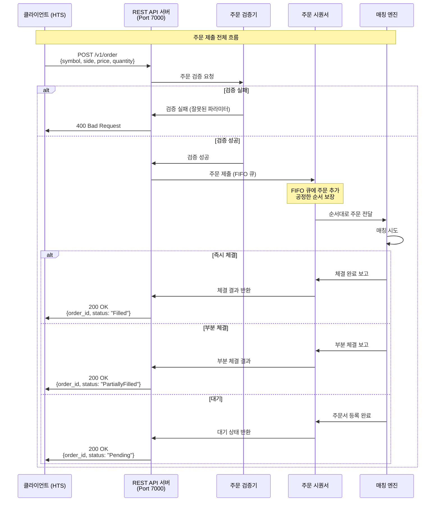
```mermaid
sequenceDiagram
    participant Client as 클라이언트 (HTS)
    participant API as REST API 서버<br/>(Port 7000)
    participant Validator as 주문 검증기
    participant Sequencer as 주문 시퀀서
    participant Engine as 매칭 엔진

    Note over Client,Engine: 주문 제출 전체 흐름

    Client->>API: POST /v1/order<br/>{symbol, side, price, quantity}

    API->>Validator: 주문 검증 요청

    alt 검증 실패
        Validator->>API: 검증 실패 (잘못된 파라미터)
        API->>Client: 400 Bad Request
    else 검증 성공
        Validator->>API: 검증 성공

        API->>Sequencer: 주문 제출 (FIFO 큐)
        Note over Sequencer: FIFO 큐에 주문 추가<br/>공정한 순서 보장

        Sequencer->>Engine: 순서대로 주문 전달

        Engine->>Engine: 매칭 시도

        alt 즉시 체결
            Engine->>Sequencer: 체결 완료 보고
            Sequencer->>API: 체결 결과 반환
            API->>Client: 200 OK<br/>{order_id, status: "Filled"}
        else 부분 체결
            Engine->>Sequencer: 부분 체결 보고
            Sequencer->>API: 부분 체결 결과
            API->>Client: 200 OK<br/>{order_id, status: "PartiallyFilled"}
        else 대기
            Engine->>Sequencer: 주문서 등록 완료
            Sequencer->>API: 대기 상태 반환
            API->>Client: 200 OK<br/>{order_id, status: "Pending"}
        end
    end
```

### 주문 검증 단계

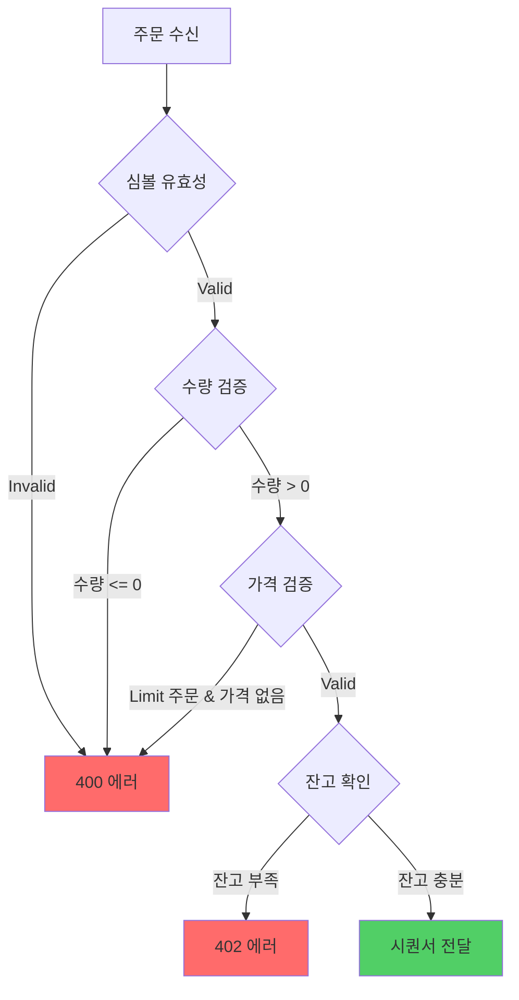
```mermaid
flowchart TD
    A[주문 수신] --> B{심볼 유효성}
    B -->|Invalid| C[400 에러]
    B -->|Valid| D{수량 검증}
    D -->|수량 <= 0| C
    D -->|수량 > 0| E{가격 검증}
    E -->|Limit 주문 & 가격 없음| C
    E -->|Valid| F{잔고 확인}
    F -->|잔고 부족| G[402 에러]
    F -->|잔고 충분| H[시퀀서 전달]

    style C fill:#ff6b6b
    style G fill:#ff6b6b
    style H fill:#51cf66
```

---

## 매칭 및 체결 흐름

### 매칭 엔진 내부 처리 흐름

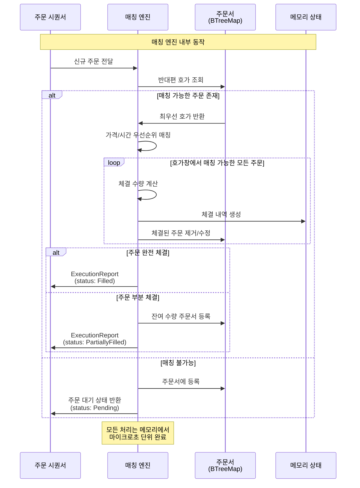
```mermaid
sequenceDiagram
    participant Sequencer as 주문 시퀀서
    participant Engine as 매칭 엔진
    participant OrderBook as 주문서<br/>(BTreeMap)
    participant Memory as 메모리 상태

    Note over Sequencer,Memory: 매칭 엔진 내부 동작

    Sequencer->>Engine: 신규 주문 전달

    Engine->>OrderBook: 반대편 호가 조회

    alt 매칭 가능한 주문 존재
        OrderBook->>Engine: 최우선 호가 반환

        Engine->>Engine: 가격/시간 우선순위 매칭

        loop 호가창에서 매칭 가능한 모든 주문
            Engine->>Engine: 체결 수량 계산
            Engine->>Memory: 체결 내역 생성
            Engine->>OrderBook: 체결된 주문 제거/수정
        end

        alt 주문 완전 체결
            Engine->>Sequencer: ExecutionReport<br/>(status: Filled)
        else 주문 부분 체결
            Engine->>OrderBook: 잔여 수량 주문서 등록
            Engine->>Sequencer: ExecutionReport<br/>(status: PartiallyFilled)
        end

    else 매칭 불가능
        Engine->>OrderBook: 주문서에 등록
        Engine->>Sequencer: 주문 대기 상태 반환<br/>(status: Pending)
    end

    Note over Engine: 모든 처리는 메모리에서<br/>마이크로초 단위 완료
```

### 주문서 매칭 알고리즘

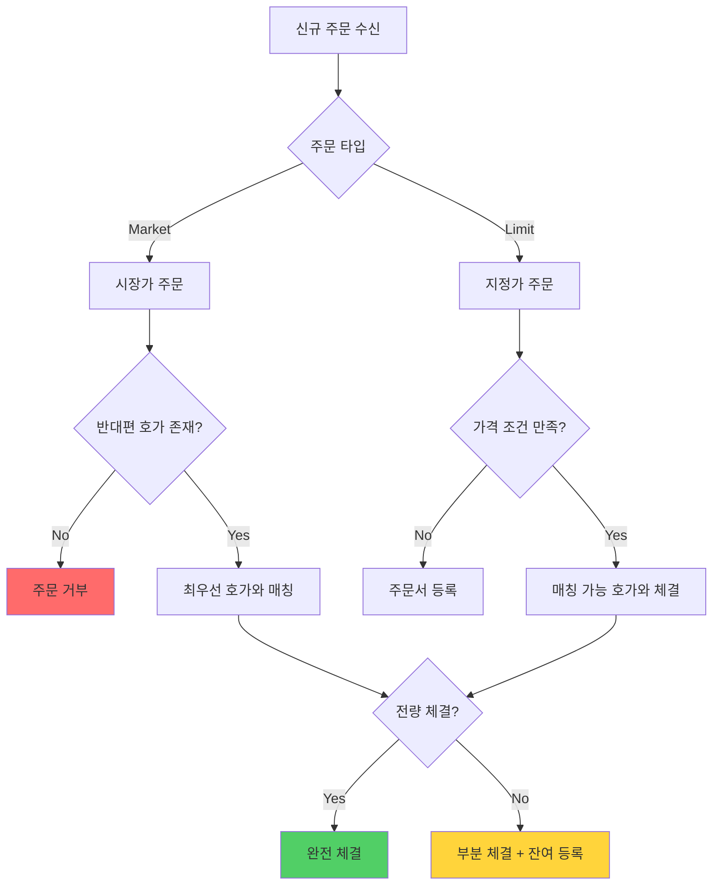
```mermaid
flowchart TD
    A[신규 주문 수신] --> B{주문 타입}
    B -->|Market| C[시장가 주문]
    B -->|Limit| D[지정가 주문]

    C --> E{반대편 호가 존재?}
    E -->|No| F[주문 거부]
    E -->|Yes| G[최우선 호가와 매칭]

    D --> H{가격 조건 만족?}
    H -->|No| I[주문서 등록]
    H -->|Yes| J[매칭 가능 호가와 체결]

    G --> K{전량 체결?}
    J --> K

    K -->|Yes| L[완전 체결]
    K -->|No| M[부분 체결 + 잔여 등록]

    style L fill:#51cf66
    style M fill:#ffd43b
    style F fill:#ff6b6b
```

---

## Kafka 통합 체결 처리 흐름

### 최종 목표: Kafka 중심 아키텍처

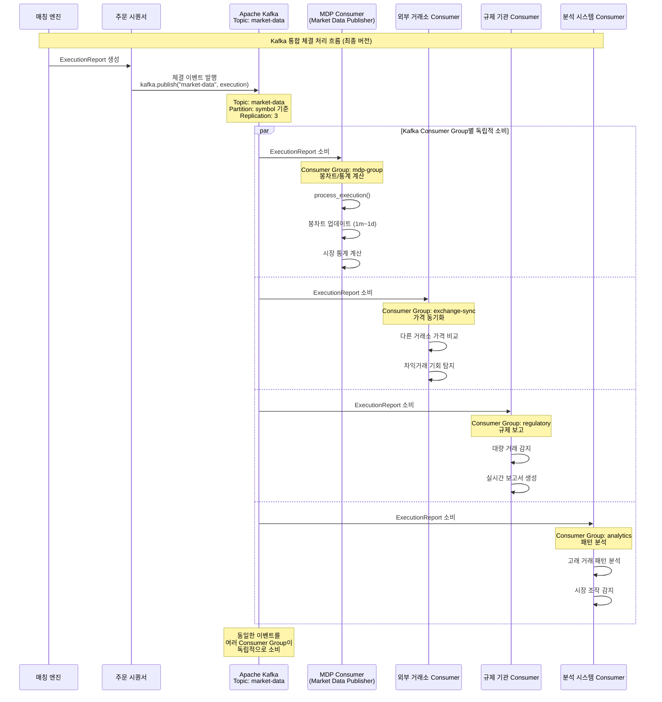
```mermaid
sequenceDiagram
    participant Engine as 매칭 엔진
    participant Sequencer as 주문 시퀀서
    participant Kafka as Apache Kafka<br/>Topic: market-data
    participant MDP as MDP Consumer<br/>(Market Data Publisher)
    participant External as 외부 거래소 Consumer
    participant Regulator as 규제 기관 Consumer
    participant Analytics as 분석 시스템 Consumer

    Note over Engine,Analytics: Kafka 통합 체결 처리 흐름 (최종 버전)

    Engine->>Sequencer: ExecutionReport 생성

    Sequencer->>Kafka: 체결 이벤트 발행<br/>kafka.publish("market-data", execution)
    Note over Kafka: Topic: market-data<br/>Partition: symbol 기준<br/>Replication: 3

    par Kafka Consumer Group별 독립적 소비
        Kafka->>MDP: ExecutionReport 소비
        Note over MDP: Consumer Group: mdp-group<br/>봉차트/통계 계산
        MDP->>MDP: process_execution()
        MDP->>MDP: 봉차트 업데이트 (1m~1d)
        MDP->>MDP: 시장 통계 계산

    and
        Kafka->>External: ExecutionReport 소비
        Note over External: Consumer Group: exchange-sync<br/>가격 동기화
        External->>External: 다른 거래소 가격 비교
        External->>External: 차익거래 기회 탐지

    and
        Kafka->>Regulator: ExecutionReport 소비
        Note over Regulator: Consumer Group: regulatory<br/>규제 보고
        Regulator->>Regulator: 대량 거래 감지
        Regulator->>Regulator: 실시간 보고서 생성

    and
        Kafka->>Analytics: ExecutionReport 소비
        Note over Analytics: Consumer Group: analytics<br/>패턴 분석
        Analytics->>Analytics: 고래 거래 패턴 분석
        Analytics->>Analytics: 시장 조작 감지
    end

    Note over Kafka: 동일한 이벤트를<br/>여러 Consumer Group이<br/>독립적으로 소비
```

### Kafka Producer 구현 (시퀀서)

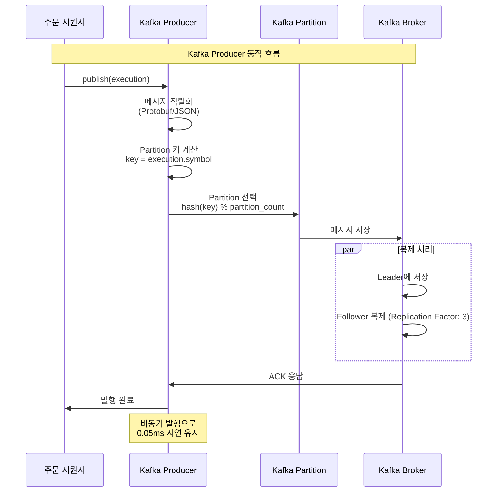
```mermaid
sequenceDiagram
    participant Sequencer as 주문 시퀀서
    participant Producer as Kafka Producer
    participant Partition as Kafka Partition
    participant Broker as Kafka Broker

    Note over Sequencer,Broker: Kafka Producer 동작 흐름

    Sequencer->>Producer: publish(execution)

    Producer->>Producer: 메시지 직렬화<br/>(Protobuf/JSON)

    Producer->>Producer: Partition 키 계산<br/>key = execution.symbol

    Producer->>Partition: Partition 선택<br/>hash(key) % partition_count

    Partition->>Broker: 메시지 저장

    par 복제 처리
        Broker->>Broker: Leader에 저장
        Broker->>Broker: Follower 복제 (Replication Factor: 3)
    end

    Broker->>Producer: ACK 응답
    Producer->>Sequencer: 발행 완료

    Note over Producer: 비동기 발행으로<br/>0.05ms 지연 유지
```

---

## 프론트엔드 데이터 수신 흐름

### 하이브리드 통신: WebSocket + REST API

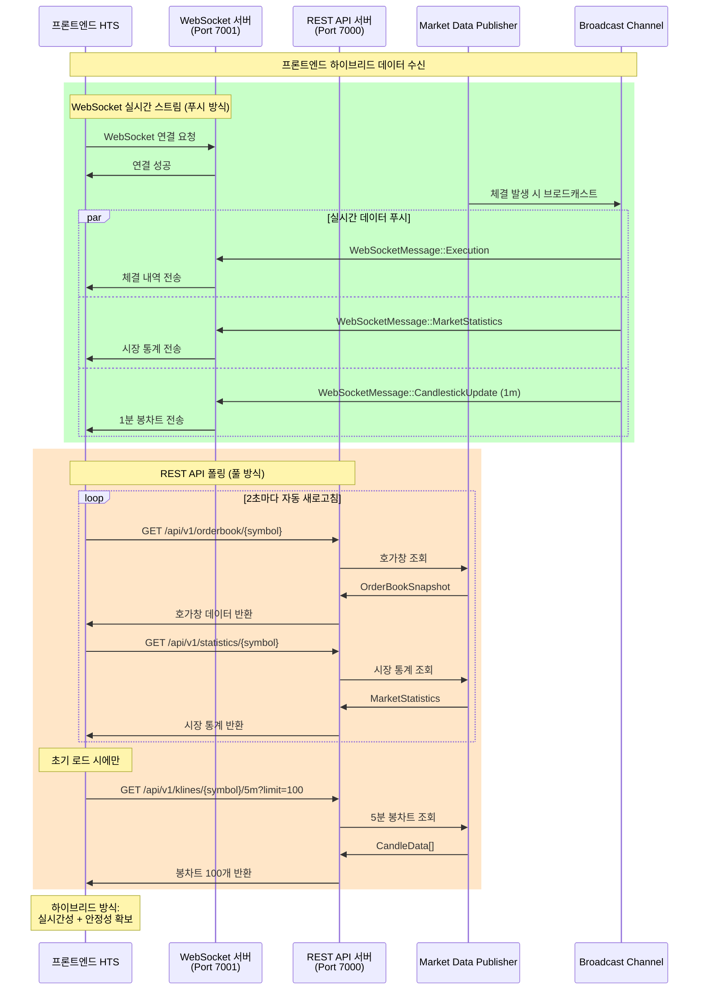
```mermaid
sequenceDiagram
    participant HTS as 프론트엔드 HTS
    participant WS as WebSocket 서버<br/>(Port 7001)
    participant API as REST API 서버<br/>(Port 7000)
    participant MDP as Market Data Publisher
    participant Broadcast as Broadcast Channel

    Note over HTS,Broadcast: 프론트엔드 하이브리드 데이터 수신

    rect rgb(200, 255, 200)
        Note over HTS,WS: WebSocket 실시간 스트림 (푸시 방식)

        HTS->>WS: WebSocket 연결 요청
        WS->>HTS: 연결 성공

        MDP->>Broadcast: 체결 발생 시 브로드캐스트

        par 실시간 데이터 푸시
            Broadcast->>WS: WebSocketMessage::Execution
            WS->>HTS: 체결 내역 전송

        and
            Broadcast->>WS: WebSocketMessage::MarketStatistics
            WS->>HTS: 시장 통계 전송

        and
            Broadcast->>WS: WebSocketMessage::CandlestickUpdate (1m)
            WS->>HTS: 1분 봉차트 전송
        end
    end

    rect rgb(255, 230, 200)
        Note over HTS,API: REST API 폴링 (풀 방식)

        loop 2초마다 자동 새로고침
            HTS->>API: GET /api/v1/orderbook/{symbol}
            API->>MDP: 호가창 조회
            MDP->>API: OrderBookSnapshot
            API->>HTS: 호가창 데이터 반환

            HTS->>API: GET /api/v1/statistics/{symbol}
            API->>MDP: 시장 통계 조회
            MDP->>API: MarketStatistics
            API->>HTS: 시장 통계 반환
        end

        Note over HTS: 초기 로드 시에만
        HTS->>API: GET /api/v1/klines/{symbol}/5m?limit=100
        API->>MDP: 5분 봉차트 조회
        MDP->>API: CandleData[]
        API->>HTS: 봉차트 100개 반환
    end

    Note over HTS: 하이브리드 방식:<br/>실시간성 + 안정성 확보
```

### 데이터 수신 방식 비교

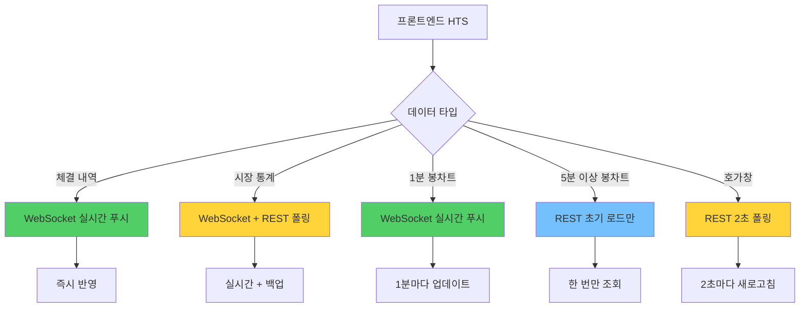
```mermaid
flowchart TD
    A[프론트엔드 HTS] --> B{데이터 타입}

    B -->|체결 내역| C[WebSocket 실시간 푸시]
    B -->|시장 통계| D[WebSocket + REST 폴링]
    B -->|1분 봉차트| E[WebSocket 실시간 푸시]
    B -->|5분 이상 봉차트| F[REST 초기 로드만]
    B -->|호가창| G[REST 2초 폴링]

    C --> H[즉시 반영]
    D --> I[실시간 + 백업]
    E --> J[1분마다 업데이트]
    F --> K[한 번만 조회]
    G --> L[2초마다 새로고침]

    style C fill:#51cf66
    style D fill:#ffd43b
    style E fill:#51cf66
    style F fill:#74c0fc
    style G fill:#ffd43b
```

---

## Redis Streams 영속화 흐름

### Consumer Group 기반 병렬 처리

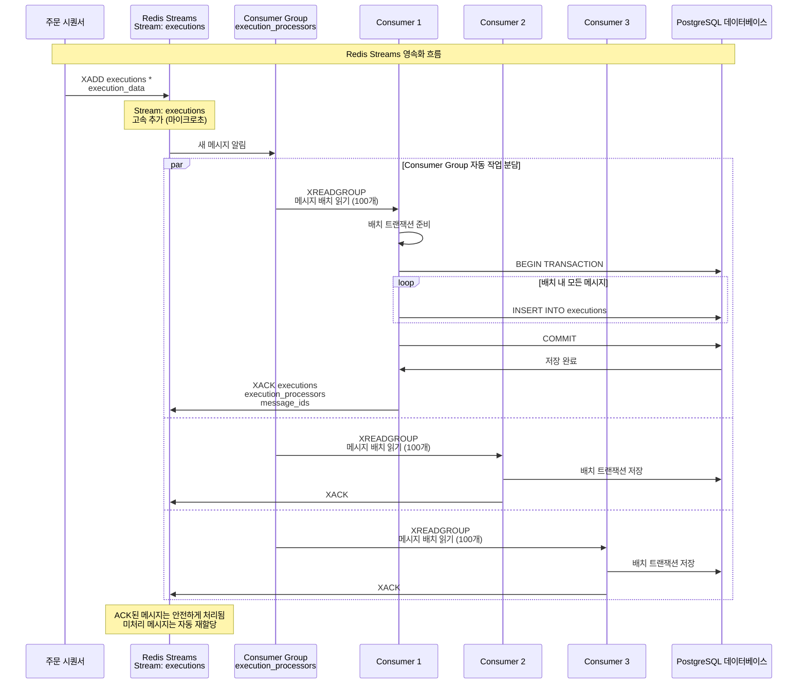
```mermaid
sequenceDiagram
    participant Sequencer as 주문 시퀀서
    participant Redis as Redis Streams<br/>Stream: executions
    participant CG as Consumer Group<br/>execution_processors
    participant C1 as Consumer 1
    participant C2 as Consumer 2
    participant C3 as Consumer 3
    participant DB as PostgreSQL 데이터베이스

    Note over Sequencer,DB: Redis Streams 영속화 흐름

    Sequencer->>Redis: XADD executions *<br/>execution_data
    Note over Redis: Stream: executions<br/>고속 추가 (마이크로초)

    Redis->>CG: 새 메시지 알림

    par Consumer Group 자동 작업 분담
        CG->>C1: XREADGROUP<br/>메시지 배치 읽기 (100개)

        C1->>C1: 배치 트랜잭션 준비
        C1->>DB: BEGIN TRANSACTION

        loop 배치 내 모든 메시지
            C1->>DB: INSERT INTO executions
        end

        C1->>DB: COMMIT
        DB->>C1: 저장 완료

        C1->>Redis: XACK executions<br/>execution_processors<br/>message_ids

    and
        CG->>C2: XREADGROUP<br/>메시지 배치 읽기 (100개)
        C2->>DB: 배치 트랜잭션 저장
        C2->>Redis: XACK

    and
        CG->>C3: XREADGROUP<br/>메시지 배치 읽기 (100개)
        C3->>DB: 배치 트랜잭션 저장
        C3->>Redis: XACK
    end

    Note over Redis: ACK된 메시지는 안전하게 처리됨<br/>미처리 메시지는 자동 재할당
```

### 장애 복구 메커니즘

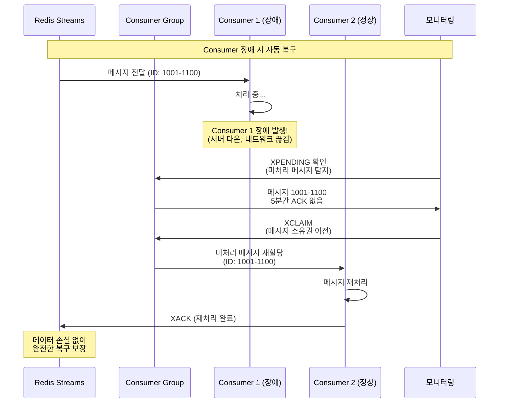
```mermaid
sequenceDiagram
    participant Redis as Redis Streams
    participant CG as Consumer Group
    participant C1 as Consumer 1 (장애)
    participant C2 as Consumer 2 (정상)
    participant Monitor as 모니터링

    Note over Redis,Monitor: Consumer 장애 시 자동 복구

    Redis->>C1: 메시지 전달 (ID: 1001-1100)
    C1->>C1: 처리 중...

    Note over C1: Consumer 1 장애 발생!<br/>(서버 다운, 네트워크 끊김)

    Monitor->>CG: XPENDING 확인<br/>(미처리 메시지 탐지)

    CG->>Monitor: 메시지 1001-1100<br/>5분간 ACK 없음

    Monitor->>CG: XCLAIM<br/>(메시지 소유권 이전)

    CG->>C2: 미처리 메시지 재할당<br/>(ID: 1001-1100)

    C2->>C2: 메시지 재처리
    C2->>Redis: XACK (재처리 완료)

    Note over Redis: 데이터 손실 없이<br/>완전한 복구 보장
```

---

## RabbitMQ WebSocket 알림 흐름

### Topic Exchange 기반 라우팅

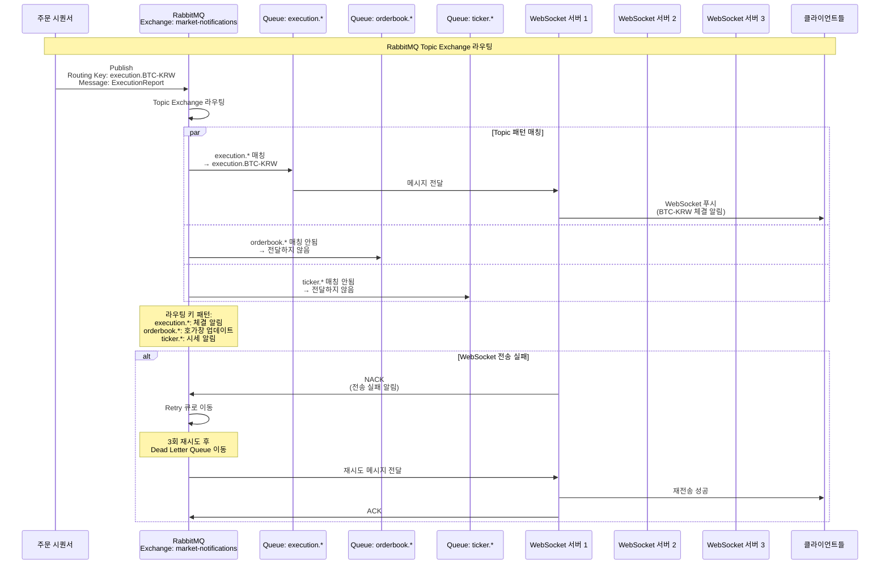
```mermaid
sequenceDiagram
    participant Sequencer as 주문 시퀀서
    participant RabbitMQ as RabbitMQ<br/>Exchange: market-notifications
    participant Q1 as Queue: execution.*
    participant Q2 as Queue: orderbook.*
    participant Q3 as Queue: ticker.*
    participant WS1 as WebSocket 서버 1
    participant WS2 as WebSocket 서버 2
    participant WS3 as WebSocket 서버 3
    participant Client as 클라이언트들

    Note over Sequencer,Client: RabbitMQ Topic Exchange 라우팅

    Sequencer->>RabbitMQ: Publish<br/>Routing Key: execution.BTC-KRW<br/>Message: ExecutionReport

    RabbitMQ->>RabbitMQ: Topic Exchange 라우팅

    par Topic 패턴 매칭
        RabbitMQ->>Q1: execution.* 매칭<br/>→ execution.BTC-KRW
        Q1->>WS1: 메시지 전달
        WS1->>Client: WebSocket 푸시<br/>(BTC-KRW 체결 알림)

    and
        RabbitMQ->>Q2: orderbook.* 매칭 안됨<br/>→ 전달하지 않음

    and
        RabbitMQ->>Q3: ticker.* 매칭 안됨<br/>→ 전달하지 않음
    end

    Note over RabbitMQ: 라우팅 키 패턴:<br/>execution.*: 체결 알림<br/>orderbook.*: 호가창 업데이트<br/>ticker.*: 시세 알림

    alt WebSocket 전송 실패
        WS1->>RabbitMQ: NACK<br/>(전송 실패 알림)
        RabbitMQ->>RabbitMQ: Retry 큐로 이동

        Note over RabbitMQ: 3회 재시도 후<br/>Dead Letter Queue 이동

        RabbitMQ->>WS1: 재시도 메시지 전달
        WS1->>Client: 재전송 성공
        WS1->>RabbitMQ: ACK
    end
```

### 다중 WebSocket 서버 로드밸런싱

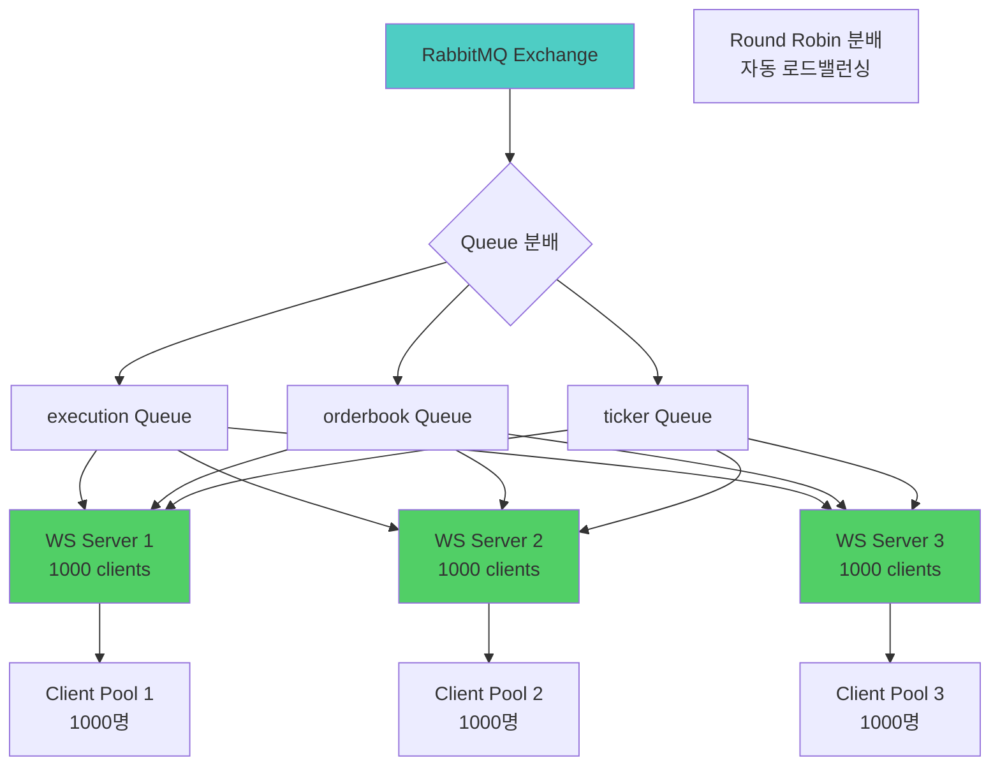
```mermaid
flowchart TD
    A[RabbitMQ Exchange] --> B{Queue 분배}

    B --> C[execution Queue]
    B --> D[orderbook Queue]
    B --> E[ticker Queue]

    C --> F[WS Server 1<br/>1000 clients]
    C --> G[WS Server 2<br/>1000 clients]
    C --> H[WS Server 3<br/>1000 clients]

    D --> F
    D --> G
    D --> H

    E --> F
    E --> G
    E --> H

    F --> I[Client Pool 1<br/>1000명]
    G --> J[Client Pool 2<br/>1000명]
    H --> K[Client Pool 3<br/>1000명]

    style A fill:#4ecdc4
    style F fill:#51cf66
    style G fill:#51cf66
    style H fill:#51cf66

    Note1[Round Robin 분배<br/>자동 로드밸런싱]
```

---

## 전체 시스템 통합 흐름

### 주문부터 알림까지 End-to-End 흐름

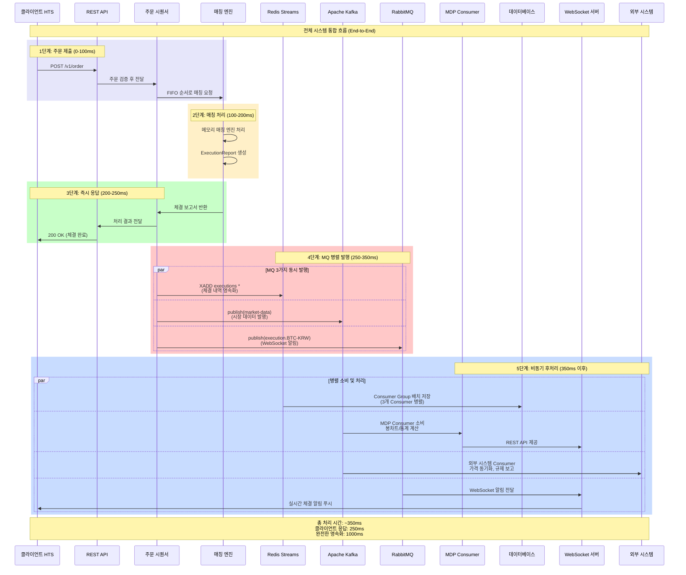
```mermaid
sequenceDiagram
    participant Client as 클라이언트 HTS
    participant API as REST API
    participant Sequencer as 주문 시퀀서
    participant Engine as 매칭 엔진
    participant Redis as Redis Streams
    participant Kafka as Apache Kafka
    participant RabbitMQ as RabbitMQ
    participant MDP as MDP Consumer
    participant DB as 데이터베이스
    participant WS as WebSocket 서버
    participant External as 외부 시스템

    Note over Client,External: 전체 시스템 통합 흐름 (End-to-End)

    rect rgb(230, 230, 250)
        Note over Client,API: 1단계: 주문 제출 (0-100ms)
        Client->>API: POST /v1/order
        API->>Sequencer: 주문 검증 후 전달
        Sequencer->>Engine: FIFO 순서로 매칭 요청
    end

    rect rgb(255, 240, 200)
        Note over Engine: 2단계: 매칭 처리 (100-200ms)
        Engine->>Engine: 메모리 매칭 엔진 처리
        Engine->>Engine: ExecutionReport 생성
    end

    rect rgb(200, 255, 200)
        Note over Sequencer,Client: 3단계: 즉시 응답 (200-250ms)
        Engine->>Sequencer: 체결 보고서 반환
        Sequencer->>API: 처리 결과 전달
        API->>Client: 200 OK (체결 완료)
    end

    rect rgb(255, 200, 200)
        Note over Redis,RabbitMQ: 4단계: MQ 병렬 발행 (250-350ms)

        par MQ 3가지 동시 발행
            Sequencer->>Redis: XADD executions *<br/>(체결 내역 영속화)
        and
            Sequencer->>Kafka: publish(market-data)<br/>(시장 데이터 발행)
        and
            Sequencer->>RabbitMQ: publish(execution.BTC-KRW)<br/>(WebSocket 알림)
        end
    end

    rect rgb(200, 220, 255)
        Note over MDP,External: 5단계: 비동기 후처리 (350ms 이후)

        par 병렬 소비 및 처리
            Redis->>DB: Consumer Group 배치 저장<br/>(3개 Consumer 병렬)

        and
            Kafka->>MDP: MDP Consumer 소비<br/>봉차트/통계 계산
            MDP->>WS: REST API 제공

        and
            Kafka->>External: 외부 시스템 Consumer<br/>가격 동기화, 규제 보고

        and
            RabbitMQ->>WS: WebSocket 알림 전달
            WS->>Client: 실시간 체결 알림 푸시
        end
    end

    Note over Client,External: 총 처리 시간: ~350ms<br/>클라이언트 응답: 250ms<br/>완전한 영속화: 1000ms
```

### 시스템 아키텍처 전체 구조

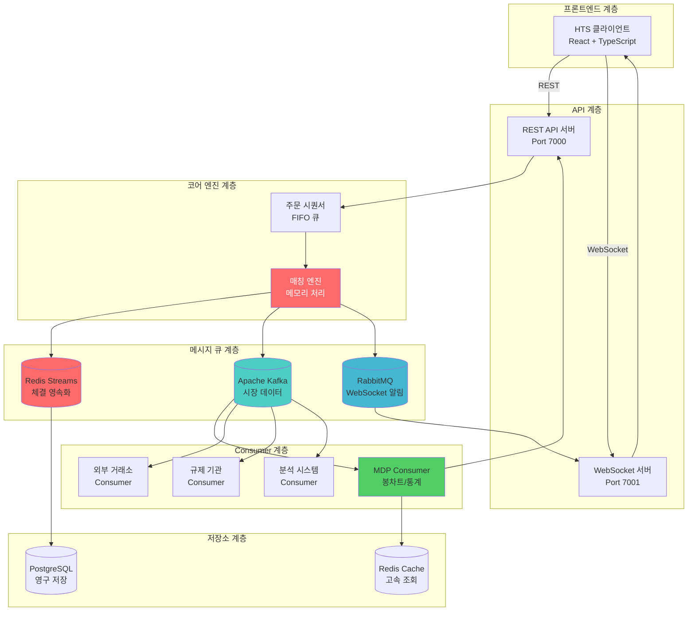
```mermaid
flowchart TB
    subgraph Frontend["프론트엔드 계층"]
        HTS[HTS 클라이언트<br/>React + TypeScript]
    end

    subgraph API["API 계층"]
        REST[REST API 서버<br/>Port 7000]
        WS[WebSocket 서버<br/>Port 7001]
    end

    subgraph Core["코어 엔진 계층"]
        Sequencer[주문 시퀀서<br/>FIFO 큐]
        Engine[매칭 엔진<br/>메모리 처리]
    end

    subgraph MQ["메시지 큐 계층"]
        Redis[(Redis Streams<br/>체결 영속화)]
        Kafka[(Apache Kafka<br/>시장 데이터)]
        RabbitMQ[(RabbitMQ<br/>WebSocket 알림)]
    end

    subgraph Consumers["Consumer 계층"]
        MDP[MDP Consumer<br/>봉차트/통계]
        External[외부 거래소<br/>Consumer]
        Regulator[규제 기관<br/>Consumer]
        Analytics[분석 시스템<br/>Consumer]
    end

    subgraph Storage["저장소 계층"]
        DB[(PostgreSQL<br/>영구 저장)]
        Cache[(Redis Cache<br/>고속 조회)]
    end

    HTS -->|REST| REST
    HTS -->|WebSocket| WS

    REST --> Sequencer
    Sequencer --> Engine

    Engine --> Redis
    Engine --> Kafka
    Engine --> RabbitMQ

    Redis --> DB

    Kafka --> MDP
    Kafka --> External
    Kafka --> Regulator
    Kafka --> Analytics

    RabbitMQ --> WS

    MDP --> Cache
    MDP --> REST

    WS --> HTS

    style Engine fill:#ff6b6b,color:#fff
    style Kafka fill:#4ecdc4
    style Redis fill:#ff6b6b
    style RabbitMQ fill:#45b7d1
    style MDP fill:#51cf66
```

---

## 장애 복구 흐름

### MQ 장애 시 복구 시나리오

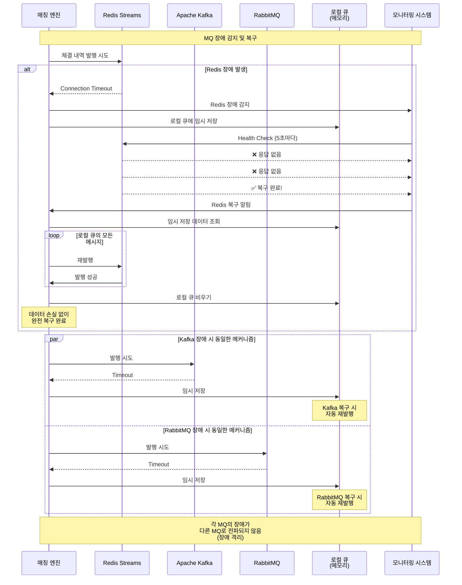
```mermaid
sequenceDiagram
    participant Engine as 매칭 엔진
    participant Redis as Redis Streams
    participant Kafka as Apache Kafka
    participant RabbitMQ as RabbitMQ
    participant LocalQueue as 로컬 큐<br/>(메모리)
    participant Monitor as 모니터링 시스템

    Note over Engine,Monitor: MQ 장애 감지 및 복구

    Engine->>Redis: 체결 내역 발행 시도

    alt Redis 장애 발생
        Redis-->>Engine: Connection Timeout
        Engine->>Monitor: Redis 장애 감지
        Engine->>LocalQueue: 로컬 큐에 임시 저장

        Monitor->>Redis: Health Check (5초마다)

        Redis-->>Monitor: ❌ 응답 없음
        Redis-->>Monitor: ❌ 응답 없음
        Redis-->>Monitor: ✅ 복구 완료!

        Monitor->>Engine: Redis 복구 알림

        Engine->>LocalQueue: 임시 저장 데이터 조회

        loop 로컬 큐의 모든 메시지
            Engine->>Redis: 재발행
            Redis->>Engine: 발행 성공
        end

        Engine->>LocalQueue: 로컬 큐 비우기

        Note over Engine: 데이터 손실 없이<br/>완전 복구 완료
    end

    par Kafka 장애 시 동일한 메커니즘
        Engine->>Kafka: 발행 시도
        Kafka-->>Engine: Timeout
        Engine->>LocalQueue: 임시 저장
        Note over LocalQueue: Kafka 복구 시<br/>자동 재발행

    and RabbitMQ 장애 시 동일한 메커니즘
        Engine->>RabbitMQ: 발행 시도
        RabbitMQ-->>Engine: Timeout
        Engine->>LocalQueue: 임시 저장
        Note over LocalQueue: RabbitMQ 복구 시<br/>자동 재발행
    end

    Note over Engine,Monitor: 각 MQ의 장애가<br/>다른 MQ로 전파되지 않음<br/>(장애 격리)
```

### 서비스 연속성 보장

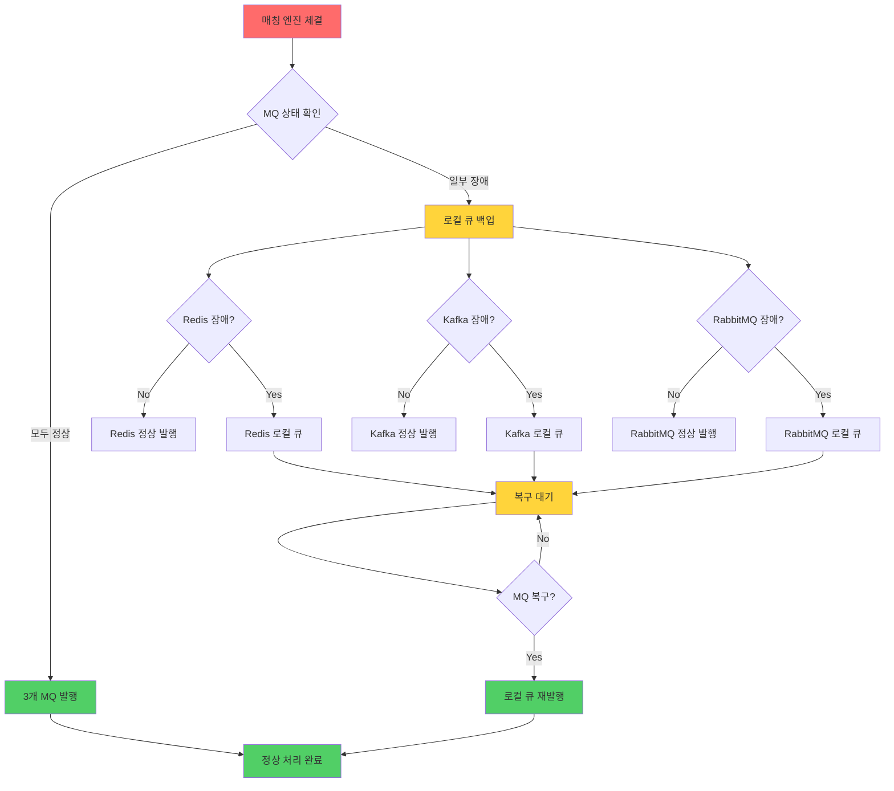
```mermaid
flowchart TD
    A[매칭 엔진 체결] --> B{MQ 상태 확인}

    B -->|모두 정상| C[3개 MQ 발행]
    B -->|일부 장애| D[로컬 큐 백업]

    C --> E[정상 처리 완료]

    D --> F{Redis 장애?}
    D --> G{Kafka 장애?}
    D --> H{RabbitMQ 장애?}

    F -->|Yes| I[Redis 로컬 큐]
    F -->|No| J[Redis 정상 발행]

    G -->|Yes| K[Kafka 로컬 큐]
    G -->|No| L[Kafka 정상 발행]

    H -->|Yes| M[RabbitMQ 로컬 큐]
    H -->|No| N[RabbitMQ 정상 발행]

    I --> O[복구 대기]
    K --> O
    M --> O

    O --> P{MQ 복구?}
    P -->|Yes| Q[로컬 큐 재발행]
    P -->|No| O

    Q --> E

    style A fill:#ff6b6b
    style C fill:#51cf66
    style D fill:#ffd43b
    style E fill:#51cf66
    style O fill:#ffd43b
    style Q fill:#51cf66
```

---

## 성능 목표 및 메트릭

### 처리 시간 목표

| 단계 | 목표 시간 | 설명 |
|------|-----------|------|
| **주문 검증** | 0-10ms | REST API 파라미터 검증 |
| **FIFO 큐 추가** | 10-50ms | 시퀀서 큐 삽입 |
| **매칭 처리** | 50-150ms | 메모리 매칭 엔진 |
| **클라이언트 응답** | 150-250ms | 즉시 응답 반환 |
| **MQ 발행** | 250-350ms | 3개 MQ 병렬 발행 |
| **DB 영속화** | 350-1000ms | 배치 저장 |
| **외부 연동** | 1000-3000ms | Kafka Consumer 처리 |

### 처리량 목표

| 컴포넌트 | 목표 TPS | 지연시간 |
|----------|----------|----------|
| **매칭 엔진** | 100,000+ TPS | 0.1ms |
| **Redis Streams** | 50,000 TPS | 0.2ms |
| **Apache Kafka** | 500,000 TPS | 0.05ms |
| **RabbitMQ** | 30,000 TPS | 0.5ms |
| **REST API** | 10,000 TPS | 50ms |
| **WebSocket** | 5,000 연결/서버 | 1ms |

---

## 결론

xTrader 시스템은 **3개의 메시지 큐를 전략적으로 활용**하여:

1. ✅ **초고속 응답**: 250ms 이내 클라이언트 응답
2. ✅ **완전한 영속화**: Redis Streams를 통한 데이터 손실 방지
3. ✅ **외부 시스템 연동**: Kafka를 통한 무제한 확장
4. ✅ **실시간 알림**: RabbitMQ를 통한 안정적인 WebSocket 분배
5. ✅ **장애 격리**: 각 MQ의 독립적인 장애 복구

**최종 목표 달성**:
- **처리량**: 100,000+ TPS
- **지연시간**: 250ms 이하
- **가용성**: 99.99% 이상
- **확장성**: 무제한 수평 확장
