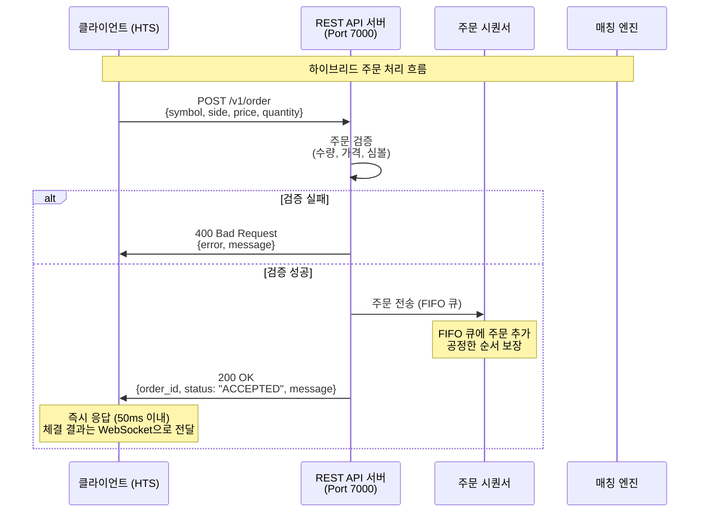
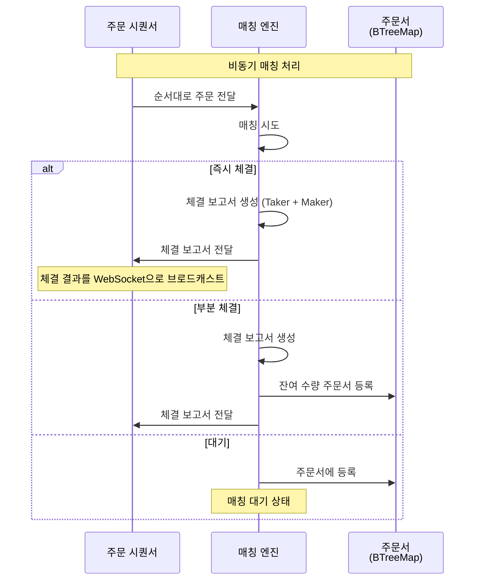
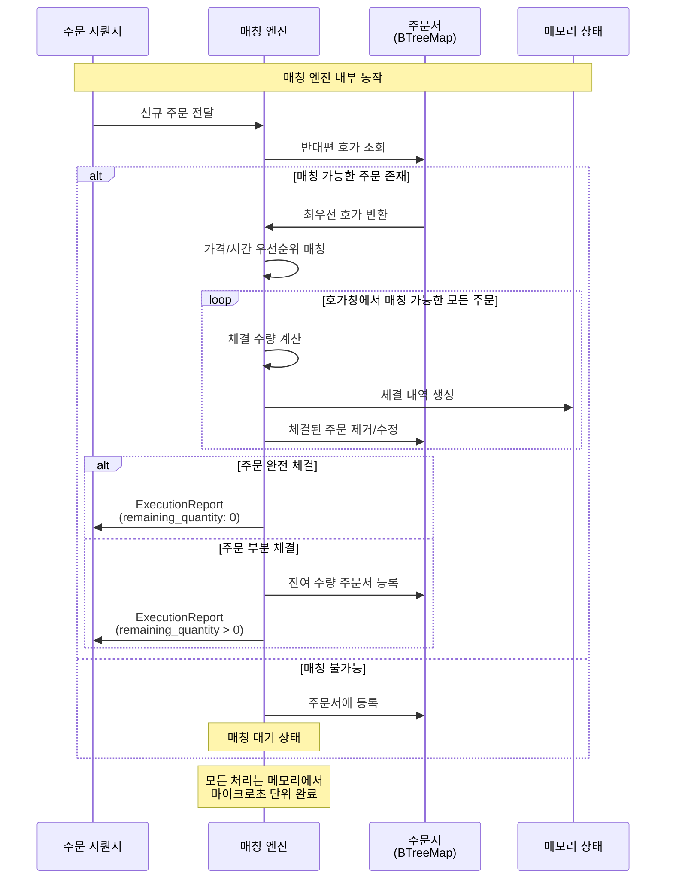
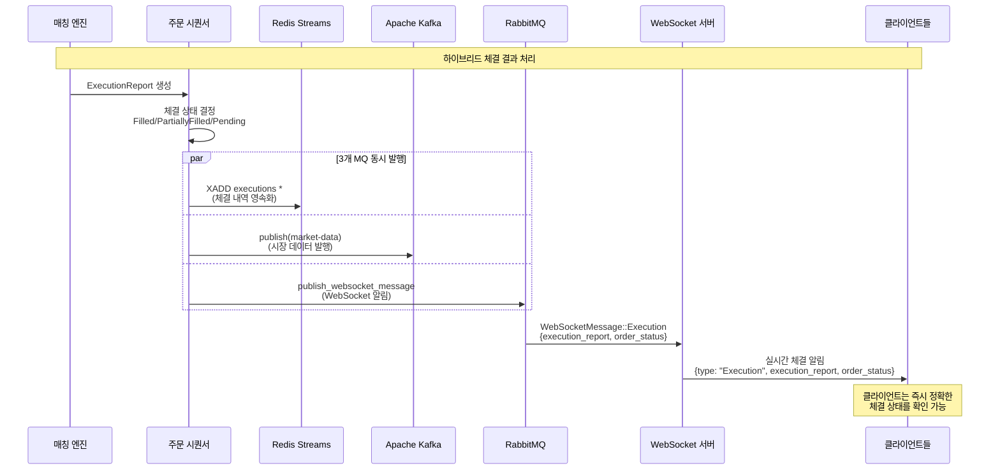
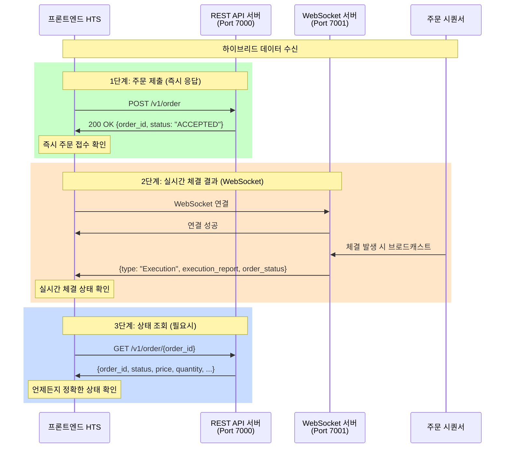
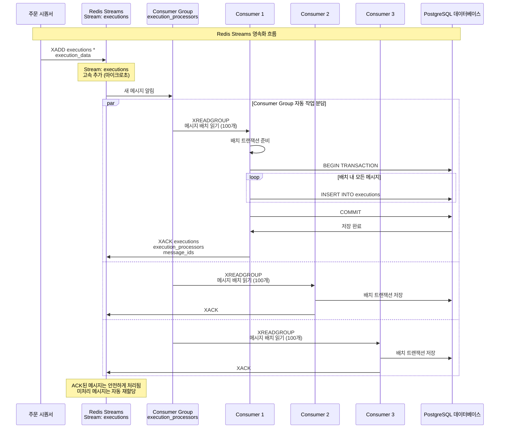
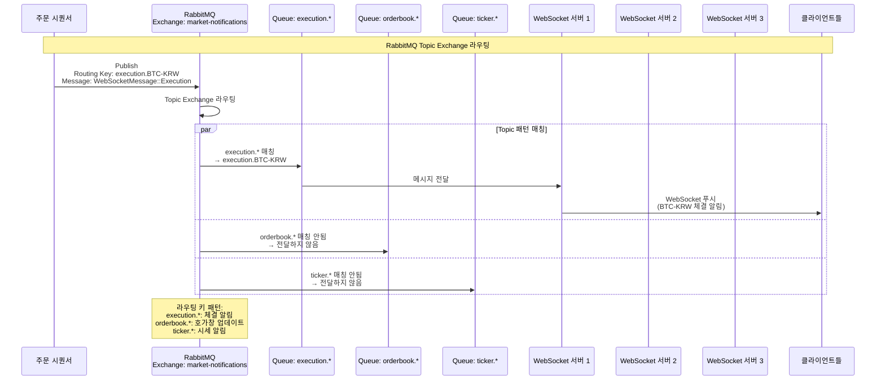
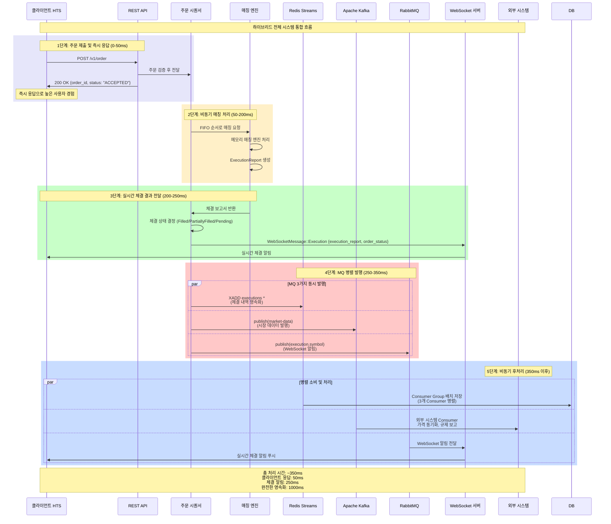
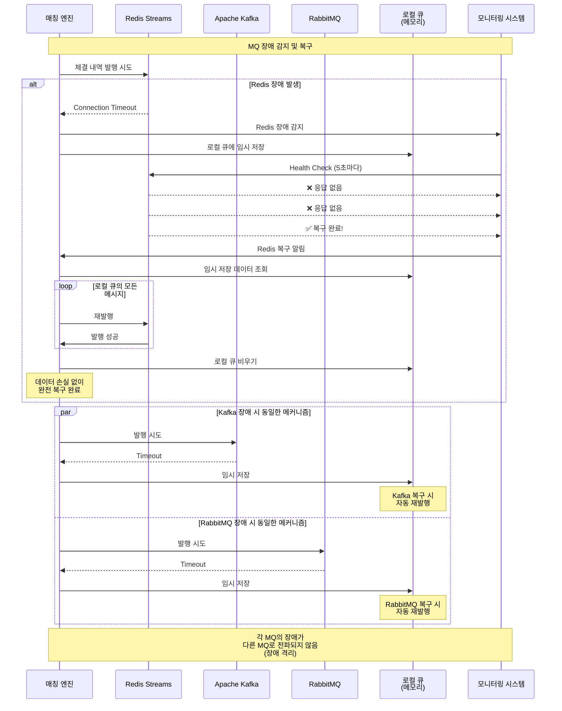

# xTrader 시스템 흐름도 (하이브리드 방식 - 실제 구현)

## 목차
1. [개요](#개요)
2. [하이브리드 주문 처리 흐름](#하이브리드-주문-처리-흐름)
3. [매칭 및 체결 흐름](#매칭-및-체결-흐름)
4. [체결 결과 처리 흐름](#체결-결과-처리-흐름)
5. [프론트엔드 데이터 수신 흐름](#프론트엔드-데이터-수신-흐름)
6. [Redis Streams 영속화 흐름](#redis-streams-영속화-흐름)
7. [RabbitMQ WebSocket 알림 흐름](#rabbitmq-websocket-알림-흐름)
8. [전체 시스템 통합 흐름](#전체-시스템-통합-흐름)
9. [장애 복구 흐름](#장애-복구-흐름)

---

## 개요

xTrader는 **하이브리드 방식의 초고성능 거래소 시스템**으로, 다음 특징을 가집니다:

- **즉시 응답**: API는 주문 접수 후 즉시 응답 (50ms 이내)
- **실시간 상태**: WebSocket으로 체결 결과와 상태 정보 실시간 전달
- **상태 조회**: REST API로 언제든지 주문 상태 확인 가능
- **3중 메시지 큐**: Redis Streams, Kafka, RabbitMQ를 활용한 고가용성

---

## 하이브리드 주문 처리 흐름

### 1단계: 주문 제출 및 즉시 응답



### 2단계: 비동기 매칭 처리



---

## 매칭 및 체결 흐름

### 매칭 엔진 내부 처리 흐름



---

## 체결 결과 처리 흐름

### 하이브리드 방식: 상태 정보 포함 체결 처리



### 체결 상태 결정 로직

```mermaid
flowchart TD
    A[ExecutionReport 수신] --> B{remaining_quantity 확인}
    
    B -->|remaining_quantity == 0| C[상태: "Filled"]
    B -->|remaining_quantity < quantity| D[상태: "PartiallyFilled"]
    B -->|remaining_quantity == quantity| E[상태: "Pending"]
    
    C --> F[WebSocket으로 상태 전달]
    D --> F
    E --> F
    
    F --> G[클라이언트 실시간 업데이트]
    
    style C fill:#51cf66
    style D fill:#ffd43b
    style E fill:#74c0fc
```

---

## 프론트엔드 데이터 수신 흐름

### 하이브리드 통신: REST API + WebSocket



### 클라이언트 구현 예시

```javascript
// 1. 주문 제출 (즉시 응답)
const orderResponse = await fetch('/v1/order', {
  method: 'POST',
  body: JSON.stringify({
    symbol: 'BTC-KRW',
    side: 'Buy',
    order_type: 'Limit',
    price: 50000000,
    quantity: 0.001
  })
});
const { order_id, status } = await orderResponse.json();
console.log(`주문 접수: ${order_id}, 상태: ${status}`);

// 2. WebSocket으로 실시간 체결 결과 수신
websocket.onmessage = (event) => {
  const message = JSON.parse(event.data);
  if (message.type === 'Execution' && message.execution_report.order_id === order_id) {
    console.log(`체결 완료: ${message.order_status}`);
    console.log(`체결 가격: ${message.execution_report.price}`);
    console.log(`체결 수량: ${message.execution_report.quantity}`);
  }
};

// 3. 필요시 상태 조회
const statusResponse = await fetch(`/v1/order/${order_id}`);
const orderStatus = await statusResponse.json();
console.log(`현재 상태: ${orderStatus.status}`);
```

---

## Redis Streams 영속화 흐름

### Consumer Group 기반 병렬 처리



---

## RabbitMQ WebSocket 알림 흐름

### Topic Exchange 기반 라우팅



---

## 전체 시스템 통합 흐름

### 하이브리드 End-to-End 흐름



---

## 장애 복구 흐름

### MQ 장애 시 복구 시나리오



---

## 성능 목표 및 메트릭

### 하이브리드 방식 처리 시간 목표

| 단계 | 목표 시간 | 설명 |
|------|-----------|------|
| **주문 검증** | 0-10ms | REST API 파라미터 검증 |
| **즉시 응답** | 10-50ms | 클라이언트 응답 반환 |
| **FIFO 큐 추가** | 50-100ms | 시퀀서 큐 삽입 |
| **매칭 처리** | 100-200ms | 메모리 매칭 엔진 |
| **체결 알림** | 200-250ms | WebSocket 실시간 전달 |
| **MQ 발행** | 250-350ms | 3개 MQ 병렬 발행 |
| **DB 영속화** | 350-1000ms | 배치 저장 |
| **외부 연동** | 1000-3000ms | Kafka Consumer 처리 |

### 처리량 목표

| 컴포넌트 | 목표 TPS | 지연시간 |
|----------|----------|----------|
| **매칭 엔진** | 100,000+ TPS | 0.1ms |
| **Redis Streams** | 50,000 TPS | 0.2ms |
| **Apache Kafka** | 500,000 TPS | 0.05ms |
| **RabbitMQ** | 30,000 TPS | 0.5ms |
| **REST API** | 10,000 TPS | 50ms |
| **WebSocket** | 5,000 연결/서버 | 1ms |

---

## 하이브리드 방식의 장점

### 1. **최고의 사용자 경험**
- **즉시 응답**: 50ms 이내 주문 접수 확인
- **실시간 알림**: WebSocket으로 체결 결과 실시간 전달
- **상태 조회**: 언제든지 정확한 주문 상태 확인

### 2. **높은 성능**
- **높은 처리량**: API 서버 블로킹 없음
- **낮은 지연시간**: 즉시 응답으로 사용자 대기 시간 최소화
- **확장성**: 각 컴포넌트 독립적 확장 가능

### 3. **안정성**
- **장애 격리**: 한 컴포넌트 장애가 다른 컴포넌트에 영향 없음
- **데이터 보존**: Redis Streams로 체결 내역 완전 보존
- **복구 능력**: 자동 장애 감지 및 복구

### 4. **개발자 친화적**
- **단순한 API**: RESTful API로 쉬운 통합
- **명확한 상태**: 체결 상태가 명확하게 구분됨
- **유연한 구현**: 클라이언트가 필요한 방식으로 구현 가능

---

## 결론

xTrader 하이브리드 시스템은 **즉시 응답 + 실시간 알림 + 상태 조회**의 장점을 모두 가진 최적의 거래소 아키텍처입니다:

1. ✅ **초고속 응답**: 50ms 이내 클라이언트 응답
2. ✅ **실시간 알림**: WebSocket으로 체결 결과 즉시 전달
3. ✅ **정확한 상태**: Filled/PartiallyFilled/Pending 상태 명확 구분
4. ✅ **완전한 영속화**: Redis Streams를 통한 데이터 손실 방지
5. ✅ **외부 시스템 연동**: Kafka를 통한 무제한 확장
6. ✅ **장애 격리**: 각 MQ의 독립적인 장애 복구

**최종 목표 달성**:
- **처리량**: 100,000+ TPS
- **지연시간**: 50ms 이하 (API 응답)
- **체결 알림**: 250ms 이하
- **가용성**: 99.99% 이상
- **확장성**: 무제한 수평 확장