# xTrader 시스템 시퀀스 다이어그램 (WebSocket 기반)

이 문서는 xTrader 거래소 시스템의 주요 시나리오에 대한 상세한 시퀀스 다이어그램을 제공합니다. 모든 실시간 데이터는 WebSocket을 통해 푸시됩니다.

## 1. 주문 제출 및 체결 시퀀스 (WebSocket 푸시)

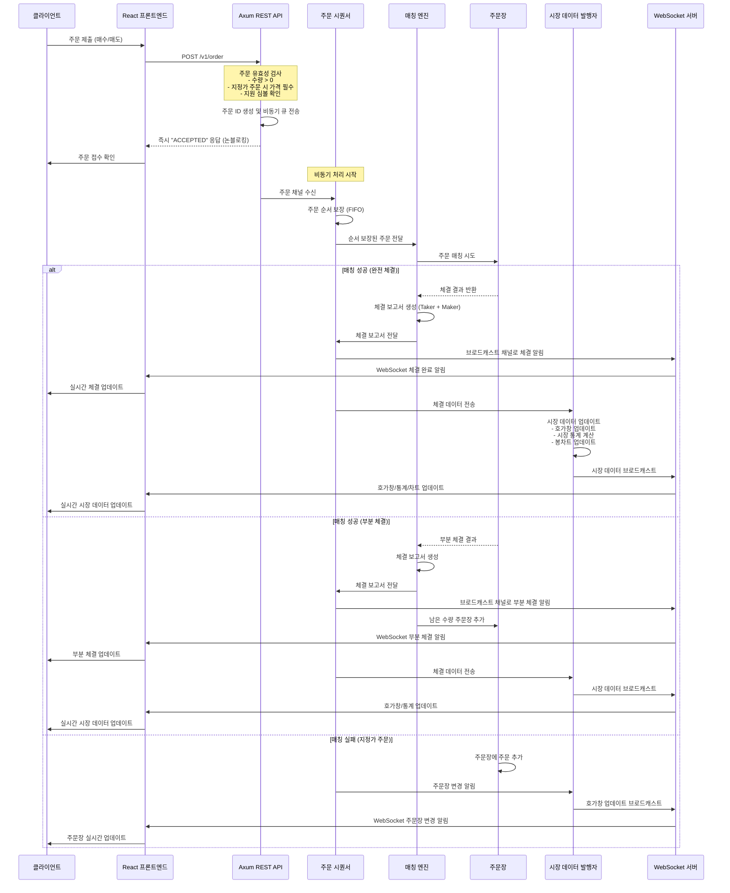

## 2. WebSocket 실시간 연결 및 구독 시스템 (이상적 아키텍처)

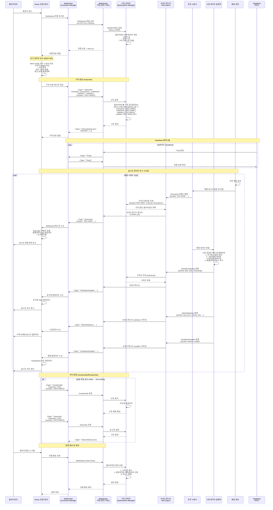

## 3. 주문 취소 시퀀스 (WebSocket 알림)

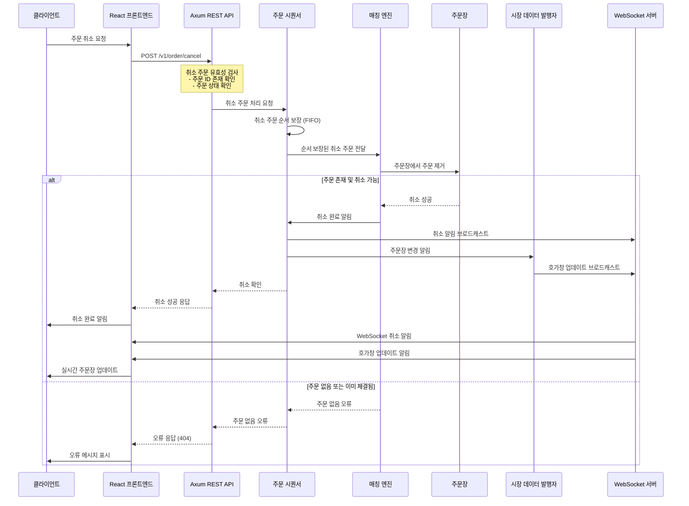

## 4. 시장 데이터 실시간 업데이트 시퀀스 (WebSocket 푸시)

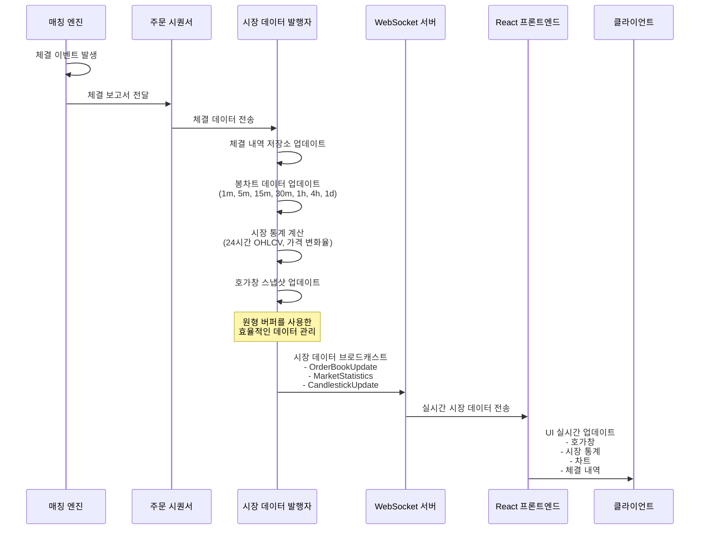

## 5. 시스템 초기화 시퀀스 (WebSocket 서버 포함)

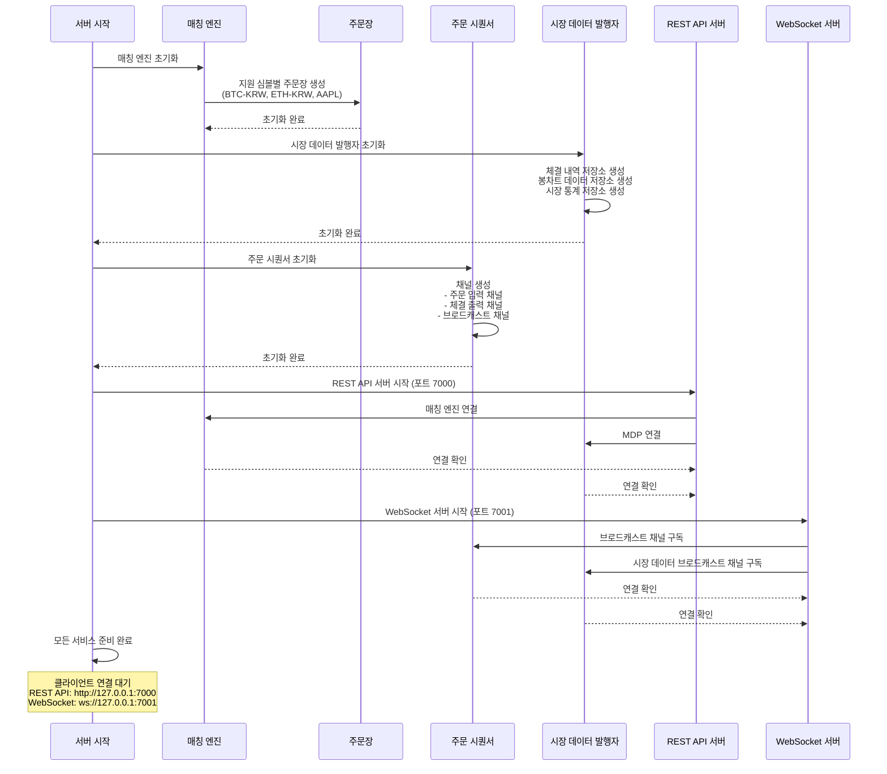

## 6. WebSocket 메시지 타입별 처리 시퀀스

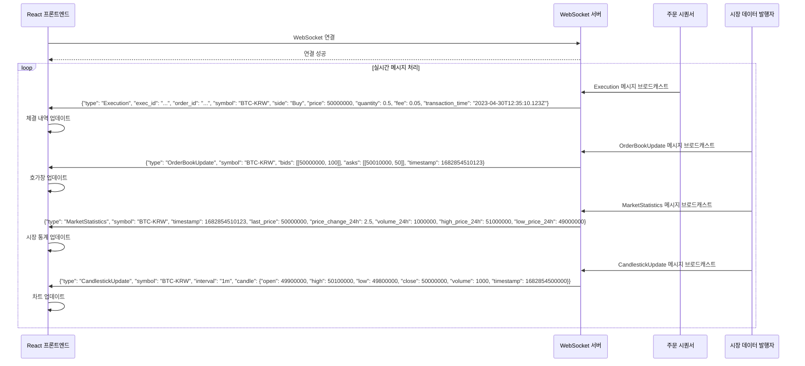

## 7. 대량 주문 처리 시퀀스 (WebSocket 실시간 알림)

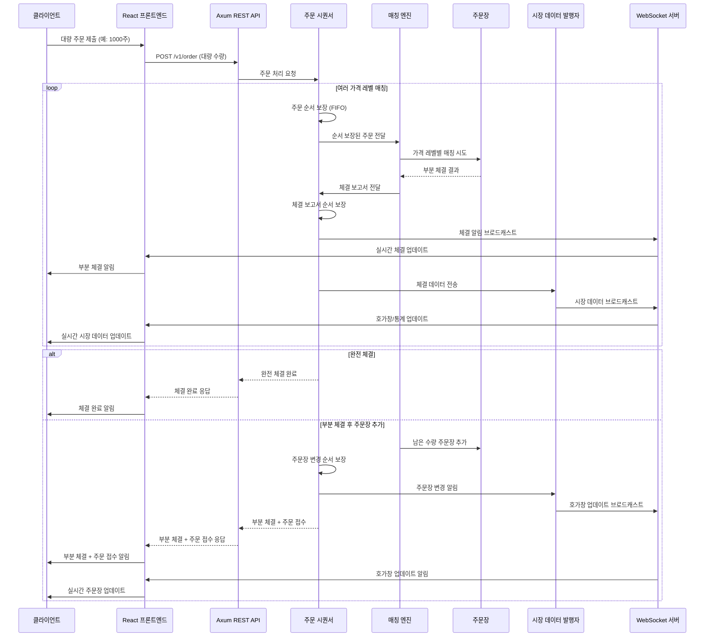

## 8. 에러 처리 시퀀스 (WebSocket 에러 메시지)

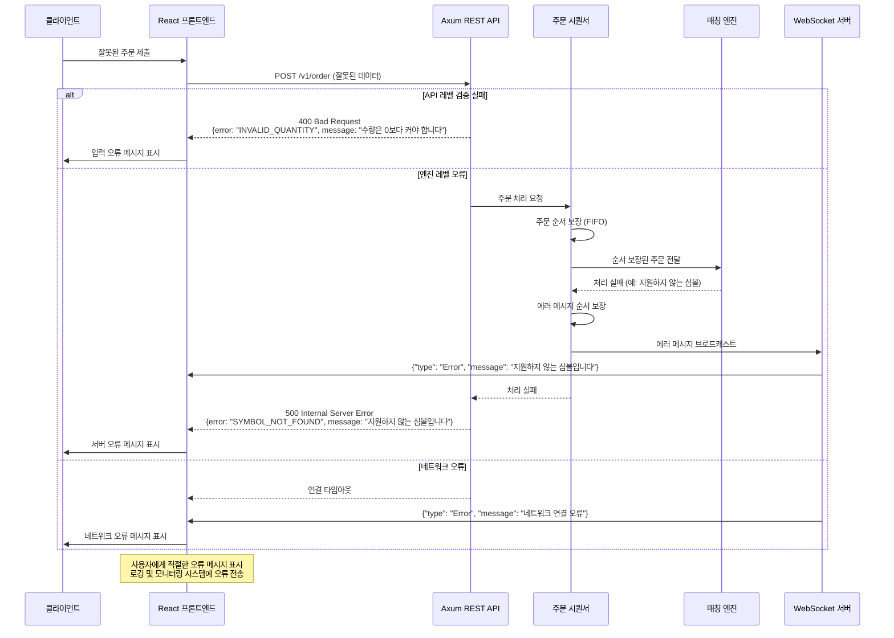

## 주요 컴포넌트 설명 (WebSocket 기반)

### 주문 시퀀서 (Order Sequencer)
- **핵심 기능**: 주문 순서 보장 및 체결 보고서 브로드캐스트
- **채널 관리**: 주문 입력, 체결 출력, 브로드캐스트 채널 관리
- **순서 보장**: FIFO 방식으로 주문 처리 순서 보장 (매칭엔진 앞단)
- **브로드캐스트**: 체결 정보를 WebSocket 클라이언트들에게 실시간 전송
- **중간 계층**: REST API와 매칭엔진 사이의 중간 계층 역할

### 매칭 엔진 (Matching Engine)
- **핵심 기능**: 주문 매칭 알고리즘의 핵심
- **우선순위**: 가격-시간 우선순위 원칙 적용
- **주문 타입**: 지정가/시장가 주문 처리
- **체결 관리**: 부분 체결 및 완전 체결 관리
- **스레드 안전**: Arc<Mutex>를 사용한 동시성 처리

### 주문장 (Order Book)
- **데이터 구조**: 매수/매도 주문을 가격별로 정렬하여 관리
- **효율성**: BTreeMap을 사용한 효율적인 매칭
- **스냅샷**: 실시간 주문서 스냅샷 제공
- **가격 레벨**: 동일 가격의 주문들을 그룹화하여 관리

### 시장 데이터 발행자 (MDP)
- **실시간 관리**: 실시간 시장 데이터 관리
- **WebSocket 푸시**: 호가창, 시장 통계, 봉차트 데이터를 WebSocket으로 푸시
- **봉차트**: 다양한 시간 간격의 봉차트 데이터 생성 및 관리
- **원형 버퍼**: 메모리 효율적인 시계열 데이터 관리

### REST API (Axum 기반)
- **HTTP 통신**: 클라이언트와의 HTTP 통신 담당
- **주문 관리**: 주문 제출, 취소, 조회 기능
- **초기 데이터**: 초기 시장 데이터 조회 API
- **에러 처리**: 적절한 HTTP 상태 코드 및 에러 메시지

### WebSocket 서버
- **실시간 푸시**: 체결 정보, 호가창, 시장 통계, 봉차트를 실시간 푸시
- **브로드캐스트**: 여러 클라이언트에게 동시 알림
- **양방향 통신**: 클라이언트와 서버 간 실시간 통신
- **메시지 타입**: Execution, OrderBookUpdate, MarketStatistics, CandlestickUpdate, Error

## 데이터 흐름 요약 (WebSocket 기반)

1. **주문 흐름**: 클라이언트 → 프론트엔드 → REST API → **시퀀서** → 매칭 엔진 → 주문장
2. **체결 푸시**: 매칭 엔진 → **시퀀서** → WebSocket 브로드캐스트 → 프론트엔드 → 클라이언트
3. **시장 데이터 푸시**: 매칭 엔진 → **시퀀서** → MDP → WebSocket 브로드캐스트 → 프론트엔드 → 클라이언트
4. **초기 데이터**: 클라이언트 → 프론트엔드 → REST API → MDP/매칭 엔진
5. **실시간 업데이트**: 모든 시장 데이터는 WebSocket을 통해 실시간 푸시
6. **순서 보장**: 시퀀서가 모든 주문과 체결의 순서를 보장하여 일관성 유지

## WebSocket 메시지 형식

### 체결 알림 (Execution)
```json
{
  "type": "Execution",
  "exec_id": "e1b724c2-5e61-4aba-8b8a-47d8a5a4f111",
  "order_id": "f8c3de3d-1fea-4d7c-a8b0-29f63c4c3454",
  "symbol": "BTC-KRW",
  "side": "Buy",
  "price": 50000000,
  "quantity": 0.5,
  "fee": 0.05,
  "transaction_time": "2023-04-30T12:35:10.123Z"
}
```

### 호가창 업데이트 (OrderBookUpdate)
```json
{
  "type": "OrderBookUpdate",
  "symbol": "BTC-KRW",
  "bids": [[50000000, 100], [49900000, 200]],
  "asks": [[50010000, 50], [50100000, 75]],
  "timestamp": 1682854510123
}
```

### 시장 통계 업데이트 (MarketStatistics)
```json
{
  "type": "MarketStatistics",
  "symbol": "BTC-KRW",
  "timestamp": 1682854510123,
  "last_price": 50000000,
  "price_change_24h": 2.5,
  "volume_24h": 1000000,
  "high_price_24h": 51000000,
  "low_price_24h": 49000000
}
```

### 봉차트 업데이트 (CandlestickUpdate)
```json
{
  "type": "CandlestickUpdate",
  "symbol": "BTC-KRW",
  "interval": "1m",
  "candle": {
    "open": 49900000,
    "high": 50100000,
    "low": 49800000,
    "close": 50000000,
    "volume": 1000,
    "timestamp": 1682854500000
  }
}
```

### 에러 메시지 (Error)
```json
{
  "type": "Error",
  "message": "지원하지 않는 심볼입니다"
}
```

## 9. 매수 주문 상세 흐름도 (WebSocket 실시간 푸시 포함)

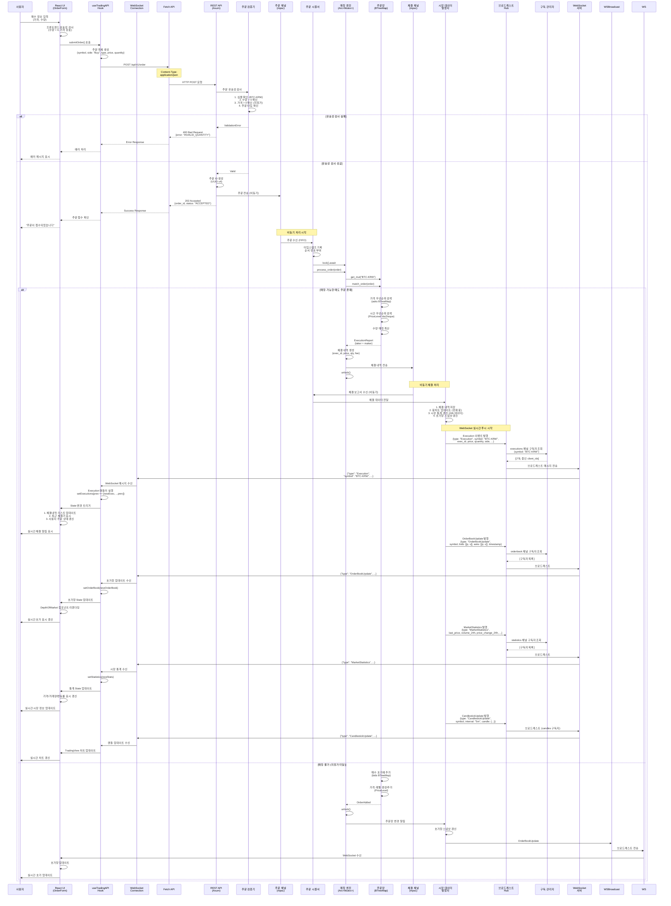

## 10. 호가창 데이터 가져오기 상세 흐름도 (REST 초기 로드 + WebSocket 실시간 갱신)

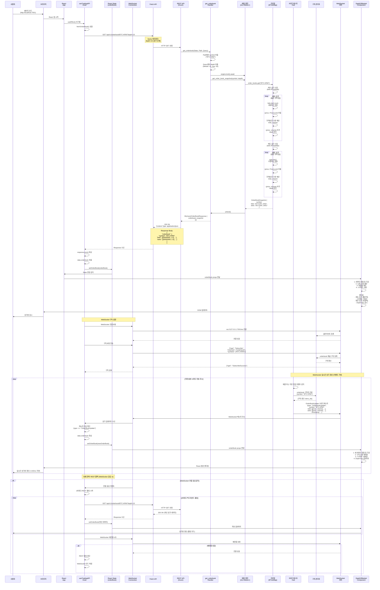

## 11. 차트 데이터 가져오기 상세 흐름도 (REST 초기 로드 + WebSocket 실시간 갱신)

```mermaid
sequenceDiagram
    participant User as 사용자
    participant Browser as 브라우저
    participant React as React<br/>App
    participant Hook as useTradingAPI<br/>Hook
    participant State as React State<br/>(candles)
    participant WSConn as WebSocket<br/>Connection
    participant Fetch as Fetch API
    participant REST as REST API<br/>(Axum)
    participant Handler as get_candles<br/>Handler
    participant MDP as 시장 데이터<br/>발행자<br/>(Arc<Mutex>)
    participant CandleStore as 봉차트 저장소<br/>(CircularBuffer)
    participant BroadcastHub as 브로드캐스트<br/>Hub
    participant SubManager as 구독 관리자
    participant WSServer as WebSocket<br/>서버
    participant Chart as TradingView<br/>Chart Component
    participant ChartLib as TradingView<br/>Lightweight Charts

    User->>Browser: 페이지 로드 or<br/>시간 간격 변경 (5분)
    Browser->>React: React 앱 시작 or<br/>interval 변경
    React->>Hook: useEffect() or<br/>fetchCandles("5m", 100)

    Hook->>Hook: interval: "5m"<br/>limit: 100 설정
    Hook->>Fetch: GET /api/v1/klines/BTC-KRW/5m?limit=100
    Note over Fetch: Query 파라미터:<br/>limit=100 (최근 100개 캔들)

    Fetch->>REST: HTTP GET 요청
    REST->>Handler: get_candles(State, Path, Query)
    Handler->>Handler: 1. Path에서 추출<br/>  - symbol: "BTC-KRW"<br/>  - interval: "5m"<br/>2. Query에서 limit 추출<br/>  - default: 100

    Handler->>Handler: interval 파싱 및 검증<br/>("5m" → CandleInterval::M5)

    alt 잘못된 interval 형식
        Handler-->>REST: 400 Bad Request<br/>{error: "INVALID_INTERVAL"}
        REST-->>Fetch: 400 Bad Request
        Fetch-->>Hook: Error Response
        Hook->>State: setError("차트 데이터 오류")
        State->>User: 에러 메시지 표시
    else 유효한 interval
        Handler->>MDP: mdp.lock().await
        Handler->>MDP: get_candles(symbol, interval, limit)

        MDP->>CandleStore: candle_store.get("BTC-KRW_5m")
        CandleStore->>CandleStore: CircularBuffer에서<br/>최근 limit개 추출

        loop 최근 100개 캔들
            CandleStore->>CandleStore: 각 캔들 데이터 추출:<br/>- open_time: u64<br/>- close_time: u64<br/>- open: u64 (시가)<br/>- high: u64 (고가)<br/>- low: u64 (저가)<br/>- close: u64 (종가)<br/>- volume: u64 (거래량)<br/>- trade_count: u64
        end

        CandleStore-->>MDP: Vec<CandlestickData>
        MDP->>Handler: unlock()
        Handler-->>REST: Ok(Json(CandleResponse {<br/>  symbol: "BTC-KRW",<br/>  interval: "5m",<br/>  candles: vec![...]<br/>}))

        REST-->>Fetch: 200 OK<br/>Content-Type: application/json
        Note over REST,Fetch: Response Body:<br/>{<br/>  "symbol": "BTC-KRW",<br/>  "interval": "5m",<br/>  "candles": [<br/>    {<br/>      "open_time": 1682854500000,<br/>      "close_time": 1682854800000,<br/>      "open": 50000000,<br/>      "high": 51000000,<br/>      "low": 49000000,<br/>      "close": 50500000,<br/>      "volume": 150,<br/>      "trade_count": 45<br/>    },<br/>    ...<br/>  ]<br/>}

        Fetch-->>Hook: Response 수신
        Hook->>Hook: 1. response.json() 파싱<br/>2. data.candles 추출
        Hook->>Hook: 데이터 검증:<br/>- open_time 중복 제거<br/>- 시간 순 정렬 (오름차순)

        Hook->>State: setCandles(정렬된 candles)
        Hook->>State: setError(null)

        State->>React: State 변경 감지
        React->>Chart: candles props 전달

        Chart->>Chart: 1. 데이터 변환<br/>  - time: open_time / 1000 (초 단위)<br/>  - open: open / 1000000 (KRW → M KRW)<br/>  - high: high / 1000000<br/>  - low: low / 1000000<br/>  - close: close / 1000000

        Chart->>Chart: 2. 중복 제거<br/>  - 동일 time 제거<br/>3. 정렬 확인<br/>  - asc by time

        Chart->>ChartLib: candlestickSeries.setData(formattedData)
        ChartLib->>ChartLib: 1. 차트 렌더링<br/>2. 캔들스틱 그리기<br/>3. 축 라벨 업데이트<br/>4. 십자선 설정

        ChartLib->>Browser: Canvas 업데이트
        Browser->>User: 차트 표시

    Note over Hook,WSConn: WebSocket 구독 설정
    Hook->>WSConn: WebSocket 연결 확인 (이미 연결됨)
    Hook->>WSConn: 구독 요청 전송
    WSConn->>WSServer: {"type": "Subscribe",<br/>"channels": ["candles"],<br/>"symbols": ["BTC-KRW"],<br/>"intervals": ["5m"]}
    WSServer->>SubManager: candles 채널 구독 등록<br/>(BTC-KRW_5m)
    SubManager-->>WSServer: 구독 확인
    WSServer-->>WSConn: {"type": "SubscribeSuccess"}
    WSConn-->>Hook: 캔들 구독 완료

    Note over MDP,ChartLib: WebSocket 실시간 캔들 업데이트 (이벤트 기반)

    loop 체결 발생 시 or 봉 마감 시
        MDP->>MDP: 1. 체결 데이터로 현재 봉 업데이트 or<br/>2. 새 봉 생성 (시간 마감 시)
        MDP->>MDP: CircularBuffer에 저장

        MDP->>BroadcastHub: CandlestickUpdate 이벤트 발행<br/>{type: "CandlestickUpdate",<br/>symbol: "BTC-KRW",<br/>interval: "5m",<br/>candle: {<br/>  open_time, close_time,<br/>  open, high, low, close,<br/>  volume, trade_count<br/>},<br/>is_closed: true/false}

        BroadcastHub->>SubManager: candles 구독자 조회<br/>(symbol: "BTC-KRW", interval: "5m")
        SubManager-->>BroadcastHub: [구독 중인 client_ids]

        BroadcastHub->>WSServer: 브로드캐스트 메시지
        WSServer->>WSConn: CandlestickUpdate 푸시
        WSConn->>Hook: 캔들 업데이트 수신
        Hook->>Hook: 메시지 타입 확인<br/>(type === "CandlestickUpdate")

        Hook->>Hook: 캔들 데이터 변환<br/>- time: open_time / 1000<br/>- open/high/low/close: 가격 정규화

        alt 기존 봉 업데이트 (is_closed: false)
            Hook->>Chart: 마지막 캔들 업데이트
            Chart->>ChartLib: candlestickSeries.update({<br/>  time, open, high, low, close<br/>})
            Note over Chart: 현재 진행 중인 봉을<br/>실시간으로 업데이트
        else 새 봉 추가 (is_closed: true)
            Hook->>State: setCandles(prev => [...prev, newCandle])
            State->>Chart: candles 배열 업데이트
            Chart->>ChartLib: candlestickSeries.setData(allCandles)
            Note over Chart: 새로운 봉 추가 후<br/>전체 차트 재구성
        end

        ChartLib->>Browser: Canvas 증분 렌더링
        Browser->>User: 실시간 차트 갱신 (<50ms 지연)
    end

    Note over User,Browser: 사용자 인터랙션

    alt 시간 간격 변경 (5분 → 1시간)
        User->>Browser: interval 버튼 클릭
        Browser->>Chart: interval 변경 요청
        Chart->>Hook: fetchCandles("1h", 100)

        Note over Hook,WSConn: 기존 구독 해제 후 재구독
        Hook->>WSConn: {"type": "Unsubscribe",<br/>"channels": ["candles"],<br/>"intervals": ["5m"]}
        WSConn->>WSServer: Unsubscribe 요청
        WSServer->>SubManager: BTC-KRW_5m 구독 제거
        SubManager-->>WSServer: 해제 확인

        Hook->>WSConn: {"type": "Subscribe",<br/>"channels": ["candles"],<br/>"intervals": ["1h"]}
        WSConn->>WSServer: Subscribe 요청
        WSServer->>SubManager: BTC-KRW_1h 구독 등록
        SubManager-->>WSServer: 구독 확인

        Note over Hook,ChartLib: REST로 새 interval 데이터 로드
        Hook->>Fetch: GET /api/v1/klines/BTC-KRW/1h?limit=100
        Fetch->>REST: HTTP GET 요청
        REST-->>Fetch: 200 OK (1시간봉 100개)
        Fetch-->>Hook: 1h 캔들 데이터
        Hook->>State: setCandles(newCandles)
        State->>Chart: 1h 캔들 배열 전달
        Chart->>ChartLib: candlestickSeries.setData(candles_1h)
        ChartLib->>Browser: 차트 전체 재렌더링
        Browser->>User: 1시간봉 차트 표시

        Note over BroadcastHub,User: 이후 1h 실시간 업데이트 수신
    end
```

## 12. WebSocket 아키텍처 전체 흐름도 (이상적 구현)

```mermaid
sequenceDiagram
    participant Client1 as 클라이언트 A
    participant Client2 as 클라이언트 B
    participant Frontend1 as React App A
    participant Frontend2 as React App B
    participant WSConn1 as WS Connection A
    participant WSConn2 as WS Connection B
    participant WSServer as WebSocket 서버<br/>(Axum WS Handler)
    participant ConnPool as 연결 풀<br/>(Arc<RwLock<HashMap>>)
    participant SubManager as 구독 관리자<br/>(TopicSubscriptions)
    participant BroadcastHub as 브로드캐스트 Hub<br/>(tokio::sync::broadcast)
    participant MsgQueue as 메시지 큐<br/>(mpsc channels)
    participant Router as 메시지 라우터
    participant Sequencer as 주문 시퀀서
    participant Engine as 매칭 엔진
    participant MDP as 시장 데이터 발행자
    participant Monitoring as 모니터링 서비스

    Note over Client1,Monitoring: 시스템 초기화 및 연결 설정

    WSServer->>ConnPool: 연결 풀 초기화<br/>HashMap<ClientId, ClientMetadata>
    WSServer->>SubManager: 구독 관리자 초기화<br/>HashMap<Topic, Vec<ClientId>>
    WSServer->>BroadcastHub: 브로드캐스트 채널 생성<br/>(capacity: 1000)
    BroadcastHub->>BroadcastHub: 채널별 브로드캐스터 생성<br/>- executions<br/>- orderbook<br/>- statistics<br/>- candles
    WSServer->>Monitoring: 모니터링 서비스 시작

    Note over Client1,Client2: 다중 클라이언트 연결

    Client1->>Frontend1: 앱 시작 (브라우저 A)
    Frontend1->>WSConn1: WebSocket 연결
    WSConn1->>WSServer: ws://127.0.0.1:7001/ws<br/>연결 요청

    WSServer->>WSServer: 클라이언트 ID 생성<br/>(UUID v4)
    WSServer->>ConnPool: client_id A 등록<br/>{id, addr, connected_at, last_ping}
    WSServer->>MsgQueue: 클라이언트 전용 메시지 큐 생성<br/>mpsc::channel(100)
    WSServer-->>WSConn1: 연결 성공<br/>{"type": "Connected", "client_id": "..."}
    WSConn1-->>Frontend1: 연결 완료

    Client2->>Frontend2: 앱 시작 (브라우저 B)
    Frontend2->>WSConn2: WebSocket 연결
    WSConn2->>WSServer: 연결 요청
    WSServer->>ConnPool: client_id B 등록
    WSServer->>MsgQueue: 클라이언트 B 큐 생성
    WSServer-->>WSConn2: 연결 성공
    WSConn2-->>Frontend2: 연결 완료

    Note over Frontend1,SubManager: 구독 설정 (클라이언트별)

    Frontend1->>WSConn1: {"type": "Subscribe",<br/>"channels": ["executions", "orderbook"],<br/>"symbols": ["BTC-KRW"]}
    WSConn1->>WSServer: Subscribe 메시지
    WSServer->>Router: 메시지 라우팅
    Router->>SubManager: 구독 등록 요청

    SubManager->>SubManager: executions 채널에 A 추가<br/>topics["executions:BTC-KRW"] = [A]
    SubManager->>SubManager: orderbook 채널에 A 추가<br/>topics["orderbook:BTC-KRW"] = [A]
    SubManager-->>Router: 구독 완료
    Router-->>WSServer: Success
    WSServer-->>WSConn1: {"type": "SubscribeSuccess"}

    Frontend2->>WSConn2: {"type": "Subscribe",<br/>"channels": ["statistics", "candles"],<br/>"symbols": ["ETH-KRW"]}
    WSConn2->>WSServer: Subscribe 메시지
    WSServer->>Router: 라우팅
    Router->>SubManager: 구독 등록

    SubManager->>SubManager: statistics 채널에 B 추가<br/>topics["statistics:ETH-KRW"] = [B]
    SubManager->>SubManager: candles 채널에 B 추가<br/>topics["candles:ETH-KRW_5m"] = [B]
    SubManager-->>WSServer: Success
    WSServer-->>WSConn2: {"type": "SubscribeSuccess"}

    Note over Monitoring,WSServer: Heartbeat 및 연결 관리

    loop 30초마다
        Monitoring->>ConnPool: 연결 상태 확인
        ConnPool-->>Monitoring: 활성 클라이언트 목록

        loop 각 클라이언트
            Monitoring->>WSServer: Ping 전송
            WSServer->>WSConn1: {"type": "Ping", "timestamp": ...}
            WSConn1->>WSServer: {"type": "Pong"}
            WSServer->>ConnPool: last_ping 업데이트 (A)

            WSServer->>WSConn2: {"type": "Ping"}
            WSConn2->>WSServer: {"type": "Pong"}
            WSServer->>ConnPool: last_ping 업데이트 (B)
        end

        Monitoring->>Monitoring: 타임아웃 클라이언트 감지<br/>(last_ping > 60초)
        alt 타임아웃 발생
            Monitoring->>WSServer: 연결 종료 요청
            WSServer->>SubManager: 구독 정리
            WSServer->>ConnPool: 클라이언트 제거
        end
    end

    Note over Engine,Frontend2: 실시간 이벤트 브로드캐스트 (BTC-KRW 체결)

    Engine->>Sequencer: BTC-KRW 체결 발생
    Sequencer->>MDP: 체결 데이터 전달

    par 병렬 브로드캐스트 (4개 채널)
        MDP->>BroadcastHub: Execution 발행<br/>{topic: "executions:BTC-KRW", ...}
        BroadcastHub->>SubManager: 구독자 조회
        SubManager-->>BroadcastHub: [A]
        BroadcastHub->>MsgQueue: A의 메시지 큐에 추가
        MsgQueue->>WSServer: 메시지 전송
        WSServer->>WSConn1: Execution 푸시
        WSConn1->>Frontend1: 체결 알림
        Frontend1->>Client1: UI 업데이트

    and
        MDP->>BroadcastHub: OrderBookUpdate 발행<br/>{topic: "orderbook:BTC-KRW", ...}
        BroadcastHub->>SubManager: 구독자 조회
        SubManager-->>BroadcastHub: [A]
        BroadcastHub->>MsgQueue: A 큐에 추가
        MsgQueue->>WSServer: 전송
        WSServer->>WSConn1: OrderBook 푸시
        WSConn1->>Frontend1: 호가창 업데이트
        Frontend1->>Client1: 호가 표시

    and
        MDP->>BroadcastHub: MarketStatistics 발행<br/>{topic: "statistics:BTC-KRW", ...}
        BroadcastHub->>SubManager: 구독자 조회
        SubManager-->>BroadcastHub: [] (A는 미구독)
        Note over BroadcastHub: 구독자 없음, 전송 안 함

    and
        MDP->>BroadcastHub: CandlestickUpdate 발행<br/>{topic: "candles:BTC-KRW_5m", ...}
        BroadcastHub->>SubManager: 구독자 조회
        SubManager-->>BroadcastHub: [] (A는 미구독)
        Note over BroadcastHub: 구독자 없음, 전송 안 함
    end

    Note over Monitoring,Client2: 성능 모니터링 및 백프레셔 제어

    Monitoring->>MsgQueue: 큐 크기 모니터링
    alt 큐 과부하 감지 (>80%)
        Monitoring->>Monitoring: 백프레셔 활성화<br/>- 낮은 우선순위 메시지 드롭<br/>- 메시지 배치 처리<br/>- 전송 속도 제한
        Monitoring->>WSServer: 경고 로그 기록<br/>"Client A queue overload"
    end

    Monitoring->>BroadcastHub: 브로드캐스트 통계 수집<br/>- 메시지/초<br/>- 구독자 수<br/>- 지연 시간
    Monitoring->>Monitoring: 메트릭 대시보드 업데이트

    Note over Frontend1,SubManager: 구독 변경 (심볼 전환)

    Frontend1->>WSConn1: {"type": "Unsubscribe",<br/>"channels": ["all"],<br/>"symbols": ["BTC-KRW"]}
    WSConn1->>WSServer: Unsubscribe
    WSServer->>Router: 라우팅
    Router->>SubManager: 구독 제거
    SubManager->>SubManager: topics["executions:BTC-KRW"].remove(A)
    SubManager->>SubManager: topics["orderbook:BTC-KRW"].remove(A)
    SubManager-->>WSServer: 해제 완료

    Frontend1->>WSConn1: {"type": "Subscribe",<br/>"channels": ["executions", "orderbook"],<br/>"symbols": ["ETH-KRW"]}
    WSConn1->>WSServer: Subscribe
    WSServer->>SubManager: ETH-KRW 구독 등록
    SubManager->>SubManager: topics["executions:ETH-KRW"] = [A]
    SubManager->>SubManager: topics["orderbook:ETH-KRW"] = [A]
    SubManager-->>WSServer: 구독 완료

    Note over Client1,ConnPool: 연결 종료 및 정리

    Client1->>Frontend1: 페이지 닫기
    Frontend1->>WSConn1: 연결 종료
    WSConn1->>WSServer: Close Frame

    WSServer->>Router: 클라이언트 A 정리 요청
    Router->>SubManager: 모든 구독 제거
    SubManager->>SubManager: topics에서 A 제거<br/>- executions:ETH-KRW<br/>- orderbook:ETH-KRW
    Router->>MsgQueue: A의 메시지 큐 종료
    Router->>ConnPool: A 연결 정보 삭제
    Router-->>WSServer: 정리 완료

    WSServer-->>WSConn1: Close Ack
    WSConn1-->>Frontend1: 연결 종료됨
```

## WebSocket 메시지 프로토콜 명세

### 클라이언트 → 서버 메시지

#### Subscribe (구독 요청)
```json
{
  "type": "Subscribe",
  "channels": ["executions", "orderbook", "statistics", "candles"],
  "symbols": ["BTC-KRW", "ETH-KRW"],
  "intervals": ["5m", "1h"]
}
```

#### Unsubscribe (구독 해제)
```json
{
  "type": "Unsubscribe",
  "channels": ["all"] | ["executions"],
  "symbols": ["BTC-KRW"] | ["all"]
}
```

#### Pong (Heartbeat 응답)
```json
{
  "type": "Pong",
  "timestamp": 1682854510123
}
```

### 서버 → 클라이언트 메시지

#### Connected (연결 확인)
```json
{
  "type": "Connected",
  "client_id": "550e8400-e29b-41d4-a716-446655440000",
  "server_time": 1682854510123
}
```

#### SubscribeSuccess (구독 성공)
```json
{
  "type": "SubscribeSuccess",
  "channels": ["executions", "orderbook"],
  "symbols": ["BTC-KRW"]
}
```

#### Execution (체결 알림)
```json
{
  "type": "Execution",
  "exec_id": "e1b724c2-5e61-4aba-8b8a-47d8a5a4f111",
  "order_id": "f8c3de3d-1fea-4d7c-a8b0-29f63c4c3454",
  "symbol": "BTC-KRW",
  "side": "Buy",
  "price": 50000000,
  "quantity": 0.5,
  "fee": 0.05,
  "timestamp": 1682854510123
}
```

#### OrderBookUpdate (호가창 업데이트)
```json
{
  "type": "OrderBookUpdate",
  "symbol": "BTC-KRW",
  "bids": [[50000000, 100], [49900000, 200]],
  "asks": [[50010000, 50], [50100000, 75]],
  "timestamp": 1682854510123
}
```

#### MarketStatistics (시장 통계)
```json
{
  "type": "MarketStatistics",
  "symbol": "BTC-KRW",
  "last_price": 50000000,
  "price_change_24h": 2.5,
  "volume_24h": 1000000,
  "high_24h": 51000000,
  "low_24h": 49000000,
  "timestamp": 1682854510123
}
```

#### CandlestickUpdate (캔들 업데이트)
```json
{
  "type": "CandlestickUpdate",
  "symbol": "BTC-KRW",
  "interval": "5m",
  "candle": {
    "open_time": 1682854500000,
    "close_time": 1682854800000,
    "open": 49900000,
    "high": 50100000,
    "low": 49800000,
    "close": 50000000,
    "volume": 1000,
    "trade_count": 45
  },
  "is_closed": false
}
```

#### Ping (Heartbeat 요청)
```json
{
  "type": "Ping",
  "timestamp": 1682854510123
}
```

#### Error (에러 메시지)
```json
{
  "type": "Error",
  "code": "SUBSCRIPTION_FAILED",
  "message": "지원하지 않는 심볼입니다: XYZ-KRW"
}
```

## 핵심 아키텍처 특징

### 1. 구독 기반 라우팅
- **Topic 패턴**: `{channel}:{symbol}` (예: `orderbook:BTC-KRW`)
- **필터링**: 클라이언트는 관심 있는 채널/심볼만 구독
- **효율성**: 불필요한 데이터 전송 방지

### 2. 비동기 브로드캐스트
- **tokio::sync::broadcast**: 고성능 pub-sub 채널
- **백프레셔 제어**: 큐 오버플로 시 우선순위 기반 드롭
- **병렬 처리**: 여러 채널 동시 브로드캐스트

### 3. 연결 풀 관리
- **Arc<RwLock<HashMap>>**: 스레드 안전한 클라이언트 관리
- **메타데이터**: 연결 시간, 마지막 Ping, 구독 목록
- **자동 정리**: 타임아웃 및 종료 시 리소스 해제

### 4. Heartbeat 메커니즘
- **주기**: 30초마다 Ping/Pong
- **타임아웃**: 60초 무응답 시 연결 종료
- **모니터링**: 연결 상태 실시간 추적

### 5. 메시지 큐 시스템
- **클라이언트별 큐**: mpsc 채널로 순서 보장
- **용량 제한**: 100개 메시지 버퍼
- **오버플로 처리**: 백프레셔 및 경고 로그

### 6. 성능 모니터링
- **메트릭 수집**: 메시지/초, 지연 시간, 구독자 수
- **과부하 감지**: 큐 크기, CPU 사용률 모니터링
- **자동 조절**: 백프레셔 활성화 및 전송 속도 제한

이러한 시퀀스 다이어그램을 통해 xTrader 시스템의 WebSocket 기반 실시간 데이터 흐름과 컴포넌트 간 상호작용을 명확히 이해할 수 있습니다. 모든 시장 데이터는 폴링 방식이 아닌 WebSocket을 통해 실시간으로 푸시되며, 구독 기반 라우팅 시스템으로 효율적인 데이터 전송을 보장합니다.