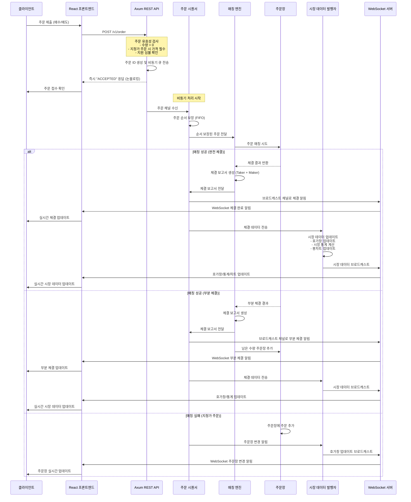
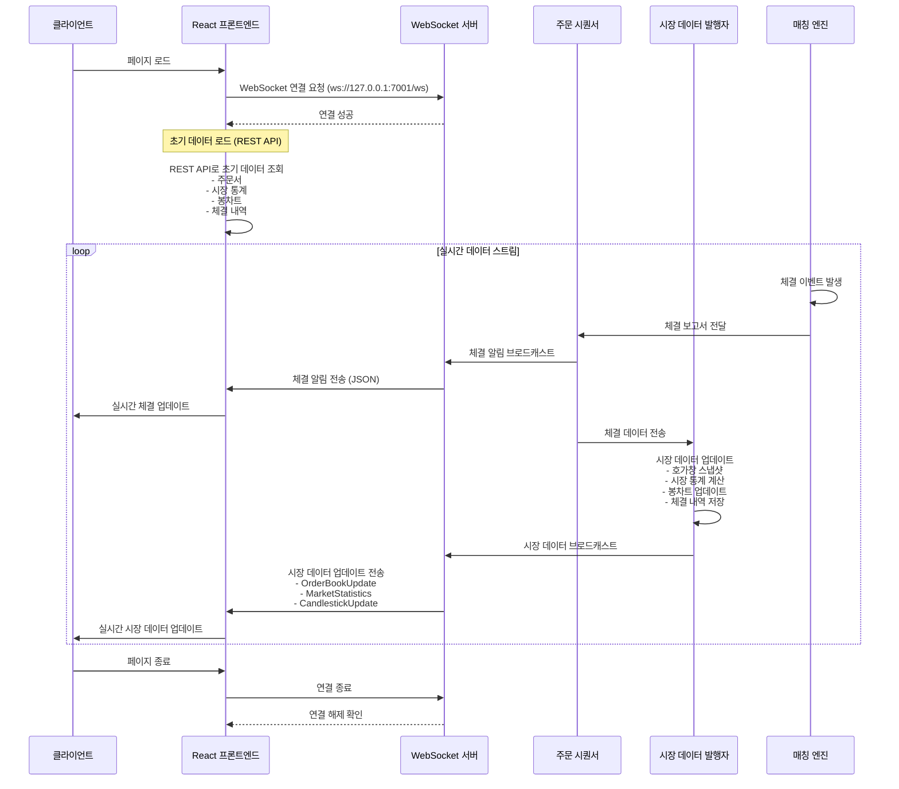
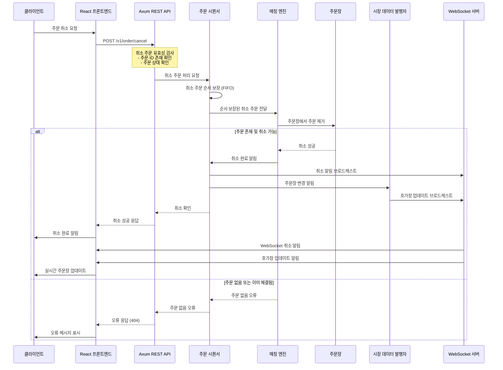
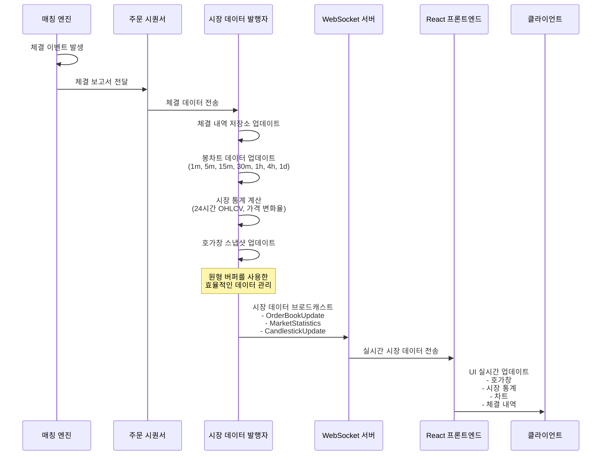
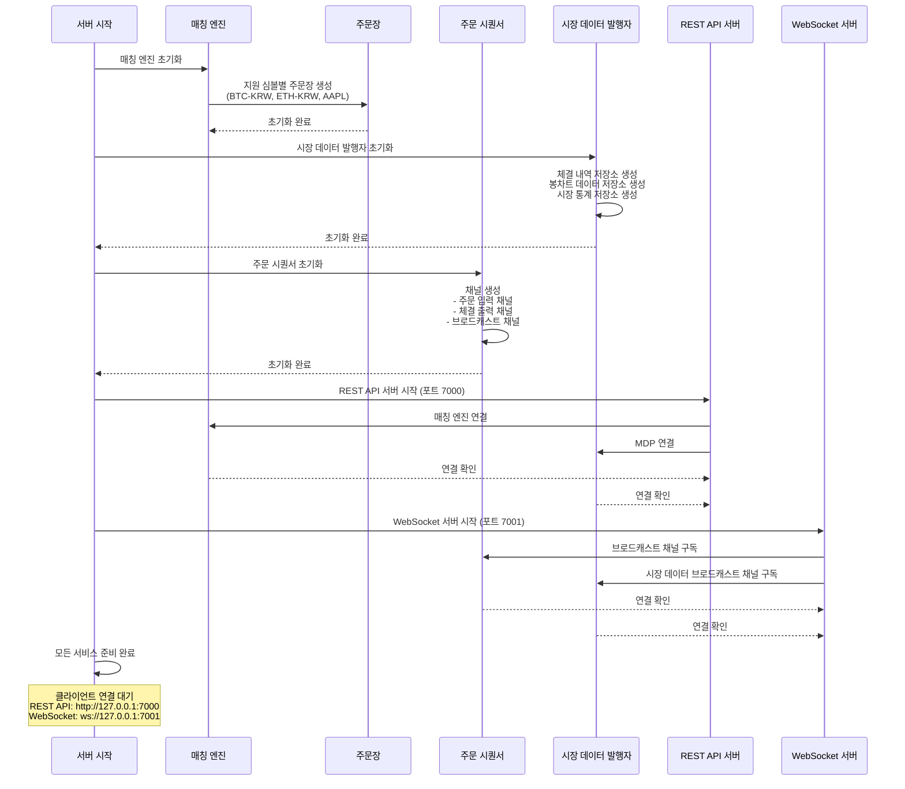
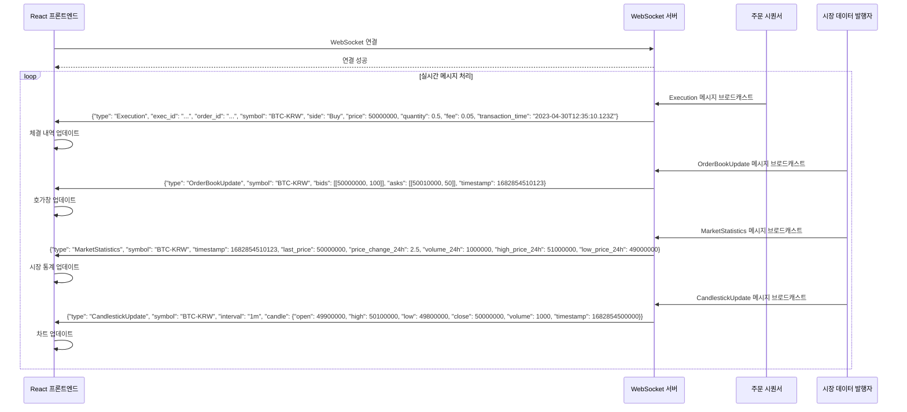
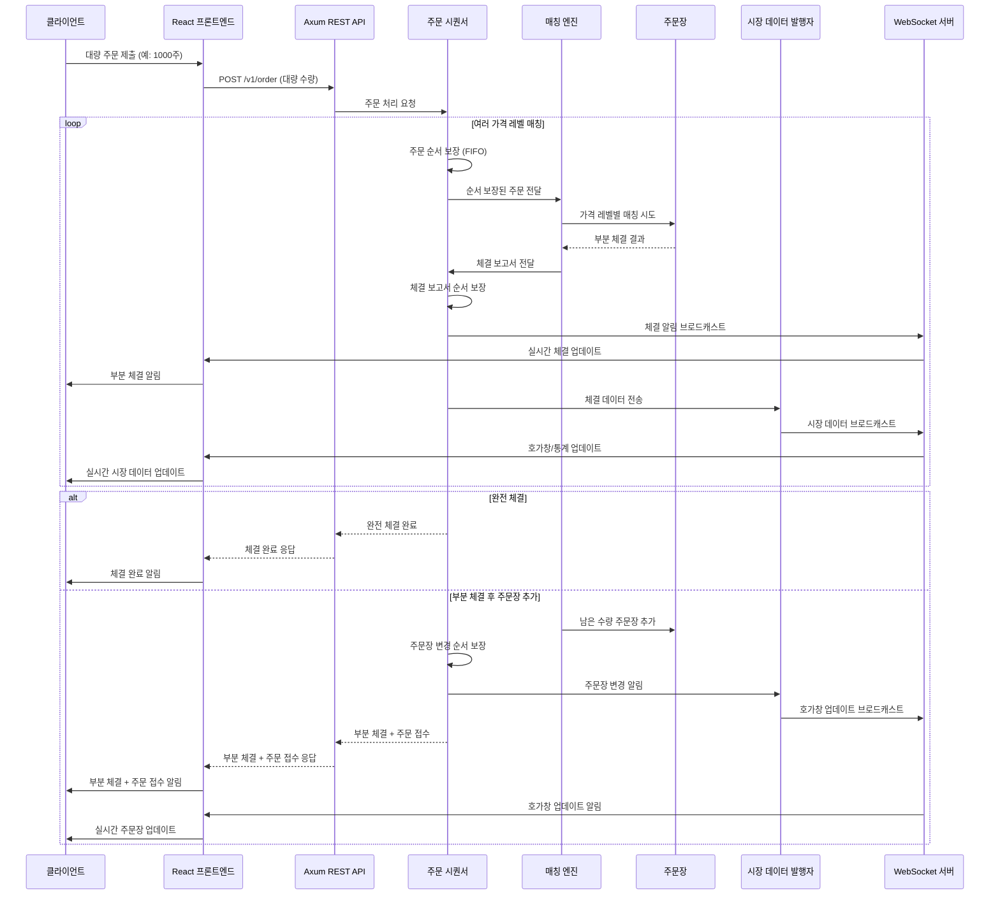
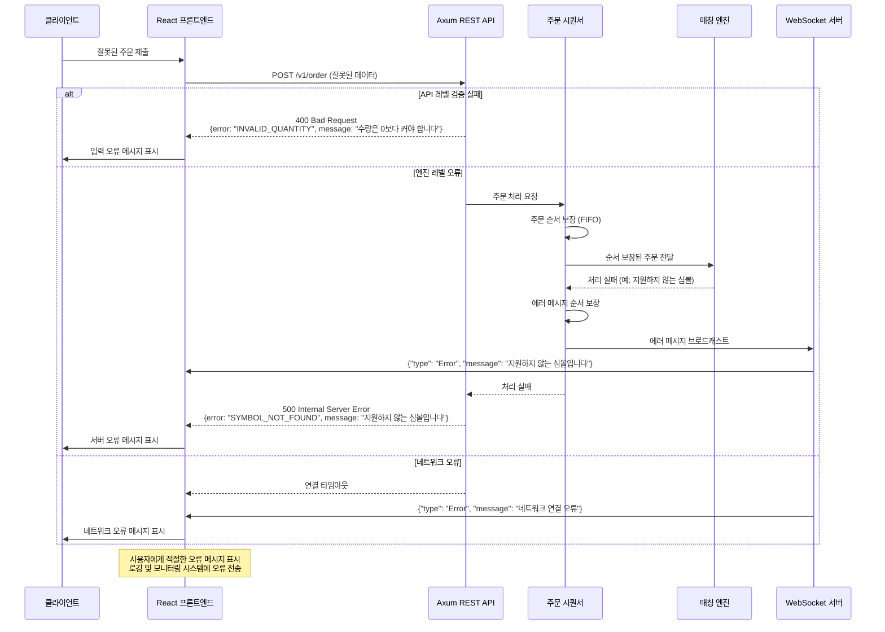

# xTrader 시스템 시퀀스 다이어그램 (WebSocket 기반)

이 문서는 xTrader 거래소 시스템의 주요 시나리오에 대한 상세한 시퀀스 다이어그램을 제공합니다. 모든 실시간 데이터는 WebSocket을 통해 푸시됩니다.

## 1. 주문 제출 및 체결 시퀀스 (WebSocket 푸시)



## 2. WebSocket 실시간 연결 및 데이터 스트림



## 3. 주문 취소 시퀀스 (WebSocket 알림)



## 4. 시장 데이터 실시간 업데이트 시퀀스 (WebSocket 푸시)



## 5. 시스템 초기화 시퀀스 (WebSocket 서버 포함)



## 6. WebSocket 메시지 타입별 처리 시퀀스



## 7. 대량 주문 처리 시퀀스 (WebSocket 실시간 알림)



## 8. 에러 처리 시퀀스 (WebSocket 에러 메시지)



## 주요 컴포넌트 설명 (WebSocket 기반)

### 주문 시퀀서 (Order Sequencer)
- **핵심 기능**: 주문 순서 보장 및 체결 보고서 브로드캐스트
- **채널 관리**: 주문 입력, 체결 출력, 브로드캐스트 채널 관리
- **순서 보장**: FIFO 방식으로 주문 처리 순서 보장 (매칭엔진 앞단)
- **브로드캐스트**: 체결 정보를 WebSocket 클라이언트들에게 실시간 전송
- **중간 계층**: REST API와 매칭엔진 사이의 중간 계층 역할

### 매칭 엔진 (Matching Engine)
- **핵심 기능**: 주문 매칭 알고리즘의 핵심
- **우선순위**: 가격-시간 우선순위 원칙 적용
- **주문 타입**: 지정가/시장가 주문 처리
- **체결 관리**: 부분 체결 및 완전 체결 관리
- **스레드 안전**: Arc<Mutex>를 사용한 동시성 처리

### 주문장 (Order Book)
- **데이터 구조**: 매수/매도 주문을 가격별로 정렬하여 관리
- **효율성**: BTreeMap을 사용한 효율적인 매칭
- **스냅샷**: 실시간 주문서 스냅샷 제공
- **가격 레벨**: 동일 가격의 주문들을 그룹화하여 관리

### 시장 데이터 발행자 (MDP)
- **실시간 관리**: 실시간 시장 데이터 관리
- **WebSocket 푸시**: 호가창, 시장 통계, 봉차트 데이터를 WebSocket으로 푸시
- **봉차트**: 다양한 시간 간격의 봉차트 데이터 생성 및 관리
- **원형 버퍼**: 메모리 효율적인 시계열 데이터 관리

### REST API (Axum 기반)
- **HTTP 통신**: 클라이언트와의 HTTP 통신 담당
- **주문 관리**: 주문 제출, 취소, 조회 기능
- **초기 데이터**: 초기 시장 데이터 조회 API
- **에러 처리**: 적절한 HTTP 상태 코드 및 에러 메시지

### WebSocket 서버
- **실시간 푸시**: 체결 정보, 호가창, 시장 통계, 봉차트를 실시간 푸시
- **브로드캐스트**: 여러 클라이언트에게 동시 알림
- **양방향 통신**: 클라이언트와 서버 간 실시간 통신
- **메시지 타입**: Execution, OrderBookUpdate, MarketStatistics, CandlestickUpdate, Error

## 데이터 흐름 요약 (WebSocket 기반)

1. **주문 흐름**: 클라이언트 → 프론트엔드 → REST API → **시퀀서** → 매칭 엔진 → 주문장
2. **체결 푸시**: 매칭 엔진 → **시퀀서** → WebSocket 브로드캐스트 → 프론트엔드 → 클라이언트
3. **시장 데이터 푸시**: 매칭 엔진 → **시퀀서** → MDP → WebSocket 브로드캐스트 → 프론트엔드 → 클라이언트
4. **초기 데이터**: 클라이언트 → 프론트엔드 → REST API → MDP/매칭 엔진
5. **실시간 업데이트**: 모든 시장 데이터는 WebSocket을 통해 실시간 푸시
6. **순서 보장**: 시퀀서가 모든 주문과 체결의 순서를 보장하여 일관성 유지

## WebSocket 메시지 형식

### 체결 알림 (Execution)
```json
{
  "type": "Execution",
  "exec_id": "e1b724c2-5e61-4aba-8b8a-47d8a5a4f111",
  "order_id": "f8c3de3d-1fea-4d7c-a8b0-29f63c4c3454",
  "symbol": "BTC-KRW",
  "side": "Buy",
  "price": 50000000,
  "quantity": 0.5,
  "fee": 0.05,
  "transaction_time": "2023-04-30T12:35:10.123Z"
}
```

### 호가창 업데이트 (OrderBookUpdate)
```json
{
  "type": "OrderBookUpdate",
  "symbol": "BTC-KRW",
  "bids": [[50000000, 100], [49900000, 200]],
  "asks": [[50010000, 50], [50100000, 75]],
  "timestamp": 1682854510123
}
```

### 시장 통계 업데이트 (MarketStatistics)
```json
{
  "type": "MarketStatistics",
  "symbol": "BTC-KRW",
  "timestamp": 1682854510123,
  "last_price": 50000000,
  "price_change_24h": 2.5,
  "volume_24h": 1000000,
  "high_price_24h": 51000000,
  "low_price_24h": 49000000
}
```

### 봉차트 업데이트 (CandlestickUpdate)
```json
{
  "type": "CandlestickUpdate",
  "symbol": "BTC-KRW",
  "interval": "1m",
  "candle": {
    "open": 49900000,
    "high": 50100000,
    "low": 49800000,
    "close": 50000000,
    "volume": 1000,
    "timestamp": 1682854500000
  }
}
```

### 에러 메시지 (Error)
```json
{
  "type": "Error",
  "message": "지원하지 않는 심볼입니다"
}
```

이러한 시퀀스 다이어그램을 통해 xTrader 시스템의 WebSocket 기반 실시간 데이터 흐름과 컴포넌트 간 상호작용을 명확히 이해할 수 있습니다. 모든 시장 데이터는 폴링 방식이 아닌 WebSocket을 통해 실시간으로 푸시됩니다.