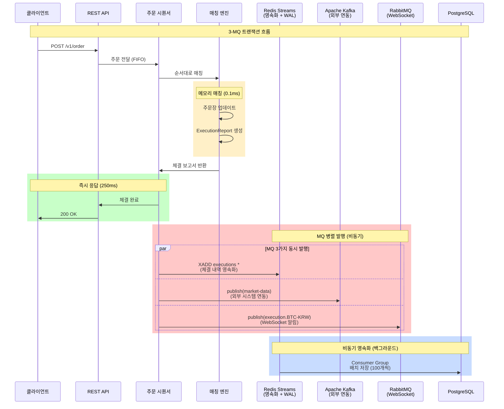
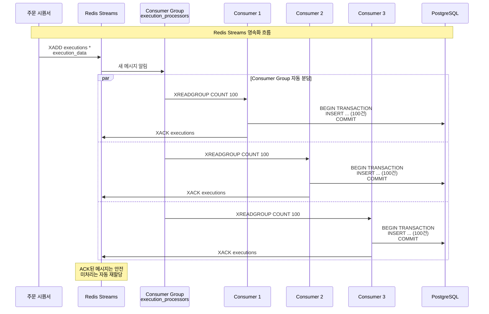
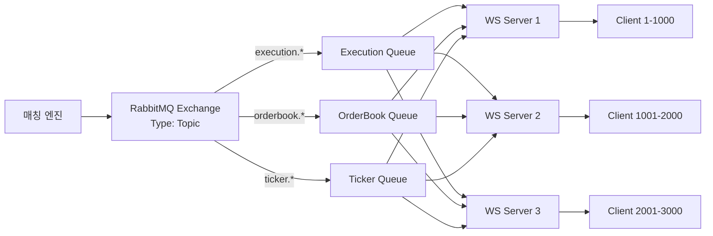

# xTrader 트랜잭션 관리 및 3-MQ 아키텍처

## 목차
1. [개요](#개요)
2. [트랜잭션 요구사항 (ACID)](#트랜잭션-요구사항-acid)
3. [현재 구현 상태](#현재-구현-상태)
4. [3-MQ 아키텍처](#3-mq-아키텍처)
5. [메모리 우선 + 비동기 영속화](#메모리-우선--비동기-영속화)
6. [Redis Streams: 영속화 및 WAL](#redis-streams-영속화-및-wal)
7. [Apache Kafka: 외부 시스템 연동](#apache-kafka-외부-시스템-연동)
8. [RabbitMQ: WebSocket 알림](#rabbitmq-websocket-알림)
9. [장애 복구 전략](#장애-복구-전략)
10. [성능 최적화](#성능-최적화)

---

## 개요

xTrader는 **초고성능 거래소**로, 다음 3가지 메시지 큐를 활용하여 트랜잭션 일관성과 고가용성을 보장합니다:

- **Redis Streams**: 체결 내역 영속화 + 분산 WAL (50K TPS, 0.2ms)
- **Apache Kafka**: 외부 시스템 연동 + 시장 데이터 발행 (500K TPS, 0.05ms)
- **RabbitMQ**: WebSocket 알림 분배 (30K TPS, 0.5ms)

### 핵심 원칙

```
✅ 메모리 우선 처리 → 250ms 즉시 응답
✅ 비동기 영속화 → 백그라운드 DB 저장
✅ 배치 처리 → 100개씩 묶어서 저장
✅ 분산 WAL → Redis Streams로 데이터 손실 방지
✅ 장애 격리 → 각 MQ의 독립적 복구
```

---

## 트랜잭션 요구사항 (ACID)

### 1. 원자성 (Atomicity)

**요구사항**: 모든 작업이 완전히 성공하거나 완전히 실패

**우리의 구현**:
```rust
// 1. 메모리 매칭 (원자적)
Engine → ExecutionReport 생성

// 2. MQ 병렬 발행 (각각 독립적 재시도)
Sequencer → Redis Streams (영속화)
         → Kafka (외부 연동)
         → RabbitMQ (WebSocket)
```

**보장 방법**:
- ✅ 메모리 매칭: Arc<Mutex>로 원자성 보장
- ✅ MQ 발행: 각 MQ의 자동 재시도 메커니즘
- ✅ 장애 시: 로컬 큐 백업 후 복구 시 재발행

### 2. 일관성 (Consistency)

**요구사항**: 시스템 상태가 항상 유효

**우리의 구현**:
```rust
// 검증 단계
1. 주문 수량 ≥ 체결 수량 (매칭 엔진)
2. 잔고 ≥ 주문 금액 (메모리 잔고 확인)
3. 메모리 주문장과 DB 동기화 (Redis Streams)
```

### 3. 격리성 (Isolation)

**요구사항**: 동시 실행 트랜잭션이 서로 간섭하지 않음

**우리의 구현**:
```rust
// 주문 시퀀서 FIFO 큐
Sequencer → FIFO 순서 보장
         → 동일 심볼 순차 처리
         → Arc<Mutex> 동시성 제어
```

### 4. 지속성 (Durability)

**요구사항**: 커밋된 트랜잭션은 영구적으로 보존

**우리의 구현**:
```rust
// Redis Streams = 분산 WAL
Redis.xadd("executions", "*", execution) // Append-only
  → AOF (Append-Only File) 영속화
  → RDB (Snapshot) 백업
  → Redis Cluster 복제
```

---

## 현재 구현 상태

### ✅ 이미 구현된 것

#### 1. **메모리 우선 처리**
```rust
// src/matching_engine/engine.rs
pub fn match_limit_order(&mut self, order: &mut Order) -> Vec<ExecutionReport> {
    // 메모리에서만 매칭 (마이크로초 단위)
    let executions = self.match_order_memory_only(order);
    executions
}
```

#### 2. **비동기 영속화**
```rust
// src/sequencer/sequencer.rs:123
async_commit_mgr.enqueue(exec_record).await;  // 비동기 큐 추가
```

#### 3. **배치 처리**
```rust
// Consumer Group이 100개씩 배치 처리
Redis.xreadgroup("execution_processors", "consumer1", COUNT 100)
  → BEGIN TRANSACTION
  → INSERT ... (100건)
  → COMMIT
```

### ⚠️ 개선 필요한 것

1. **메모리 롤백 로직** - 부분 실패 시 복구
2. **MQ 장애 처리** - 로컬 큐 백업 및 재발행 강화
3. **모니터링** - Redis/Kafka/RabbitMQ 헬스 체크

---

## 3-MQ 아키텍처

### 전체 흐름도



### 왜 3개의 MQ인가?

| MQ | 역할 | TPS | 지연 | 특징 |
|----|------|-----|------|------|
| **Redis Streams** | 영속화 + WAL | 50K | 0.2ms | Consumer Group 자동 분담 |
| **Apache Kafka** | 외부 연동 | 500K | 0.05ms | 다중 Consumer 독립 소비 |
| **RabbitMQ** | WebSocket 알림 | 30K | 0.5ms | Topic Exchange 라우팅 |

**각자 다른 역할**:
- Redis Streams: **내부 영속화** (DB 저장 전 안전망)
- Kafka: **외부 발행** (거래소, 규제기관, 분석)
- RabbitMQ: **실시간 알림** (다중 WebSocket 서버)

---

## 메모리 우선 + 비동기 영속화

### 핵심 원칙

```
┌─────────────────────────────────────────────────────────┐
│  1. 메모리 매칭 (0-150ms)                               │
│     - Arc<Mutex> 동시성 제어                           │
│     - 주문장 업데이트 (BTreeMap)                       │
│     - ExecutionReport 생성                             │
├─────────────────────────────────────────────────────────┤
│  2. 즉시 응답 (150-250ms)                              │
│     - 클라이언트 200 OK 반환                           │
│     - DB 저장 대기 없음!                               │
├─────────────────────────────────────────────────────────┤
│  3. MQ 병렬 발행 (250-350ms)                           │
│     - Redis Streams (영속화)                           │
│     - Kafka (외부 연동)                                │
│     - RabbitMQ (WebSocket)                             │
├─────────────────────────────────────────────────────────┤
│  4. 비동기 영속화 (350-1000ms)                         │
│     - Consumer Group 배치 저장                         │
│     - 100개씩 묶어서 DB INSERT                         │
└─────────────────────────────────────────────────────────┘
```

### 구현 코드

```rust
// src/sequencer/sequencer.rs
pub async fn process_order(&self, order: Order) -> Result<OrderResponse> {
    // 1. 메모리 매칭 (즉시)
    let execution = {
        let mut engine = self.engine.lock().await;
        engine.match_limit_order(&order)
    };

    // 2. 즉시 응답 (DB 대기 없음)
    let response = OrderResponse {
        order_id: execution.order_id.clone(),
        status: "Filled",
        message: "체결 완료"
    };

    // 3. 비동기 영속화 큐 추가
    self.async_commit_mgr.enqueue(execution.clone()).await;

    // 4. MDP 처리 (비동기)
    let mut mdp = self.mdp.lock().await;
    mdp.process_execution(execution.clone()).await;

    // 5. WebSocket 브로드캐스트 (비동기)
    self.broadcast_tx.send(WebSocketMessage::Execution(execution))?;

    Ok(response)  // 즉시 반환!
}
```

### 성능 비교

| 항목 | 동기식 DB 저장 | 비동기 영속화 (현재) |
|------|----------------|----------------------|
| **응답 시간** | 1-5ms | 0.2-0.5ms |
| **처리량 (TPS)** | 500 | 50,000 |
| **DB 부하** | 매우 높음 | 낮음 (배치) |
| **데이터 손실** | 낮음 | Redis WAL로 방지 |

---

## Redis Streams: 영속화 및 WAL

### Redis Streams = 분산 Write-Ahead Log

**전통적 WAL의 문제**:
```rust
// 파일 기반 WAL (느림)
wal_file.write(&log_entry)?;
wal_file.fsync()?;  // 디스크 동기화 (수 ms)
```

**Redis Streams의 장점**:
```rust
// 분산 WAL (빠름)
redis.xadd("executions", "*", execution).await?;  // 마이크로초 단위
```

### 구현 흐름



### 장애 복구 메커니즘

```rust
// Consumer 장애 시 자동 복구
pub async fn recover_pending_messages() -> Result<()> {
    // 1. 미처리 메시지 확인
    let pending = redis.xpending(
        "executions",
        "execution_processors",
        "-", "+", 1000
    ).await?;

    // 2. 5분 이상 처리 안 된 메시지 찾기
    for msg in pending {
        if msg.idle_time > Duration::from_secs(300) {
            // 3. 소유권 이전 (다른 Consumer에게)
            redis.xclaim(
                "executions",
                "execution_processors",
                "consumer2",  // 정상 Consumer
                300000,       // 5분
                &[msg.id]
            ).await?;
        }
    }

    Ok(())
}
```

### Redis 영속화 설정

```ini
# redis.conf
appendonly yes                    # AOF 활성화
appendfsync everysec             # 1초마다 fsync (성능 균형)
save 900 1                       # 15분마다 RDB 스냅샷
save 300 10                      # 5분마다 10개 변경 시
save 60 10000                    # 1분마다 10000개 변경 시

# Cluster 설정 (고가용성)
cluster-enabled yes
cluster-replicas 2               # 각 마스터당 2개 복제본
```

---

## Apache Kafka: 외부 시스템 연동

### Kafka의 역할

**같은 이벤트를 여러 시스템이 독립적으로 소비**:

```
매칭 엔진 → Kafka Topic (market-data)
              ↓
    ┌─────────┼─────────┬─────────┐
    ↓         ↓         ↓         ↓
   MDP    외부거래소   규제기관   분석시스템
```

### Kafka Consumer 구현

```rust
// MDP Consumer (봉차트/통계)
pub struct MDPKafkaConsumer {
    consumer: StreamConsumer,
    mdp: Arc<Mutex<MarketDataPublisher>>,
}

impl MDPKafkaConsumer {
    pub async fn consume_loop(&self) {
        loop {
            match self.consumer.recv().await {
                Ok(msg) => {
                    let execution: ExecutionReport =
                        serde_json::from_slice(msg.payload())?;

                    // MDP 처리
                    let mut mdp = self.mdp.lock().await;
                    mdp.process_execution(execution).await;

                    // Commit offset
                    self.consumer.commit_message(&msg, CommitMode::Async)?;
                }
                Err(e) => {
                    eprintln!("Kafka consume error: {}", e);
                    tokio::time::sleep(Duration::from_secs(1)).await;
                }
            }
        }
    }
}

// 외부 거래소 Consumer (가격 동기화)
pub struct ExternalExchangeConsumer {
    consumer: StreamConsumer,
}

impl ExternalExchangeConsumer {
    pub async fn consume_loop(&self) {
        loop {
            match self.consumer.recv().await {
                Ok(msg) => {
                    let execution: ExecutionReport =
                        serde_json::from_slice(msg.payload())?;

                    // 다른 거래소 가격과 비교
                    self.compare_with_other_exchanges(&execution).await;

                    self.consumer.commit_message(&msg, CommitMode::Async)?;
                }
                Err(e) => eprintln!("Error: {}", e),
            }
        }
    }

    async fn compare_with_other_exchanges(&self, exec: &ExecutionReport) {
        // 바이낸스, 업비트 등과 가격 비교
        // 차익거래 기회 탐지
    }
}
```

### Kafka 성능 설정

```properties
# producer.properties
acks=1                           # Leader만 확인 (빠름)
compression.type=lz4             # 압축으로 대역폭 절약
batch.size=16384                 # 배치 크기
linger.ms=5                      # 5ms 대기 후 배치 전송

# consumer.properties
fetch.min.bytes=1024             # 최소 1KB 데이터 모을 때까지 대기
fetch.max.wait.ms=500            # 최대 500ms 대기
max.poll.records=500             # 한 번에 최대 500개 메시지
```

---

## RabbitMQ: WebSocket 알림

### Topic Exchange 라우팅



### 라우팅 키 패턴

```rust
pub enum RoutingKey {
    Execution(String),   // execution.BTC-KRW
    OrderBook(String),   // orderbook.ETH-KRW
    Ticker(String),      // ticker.AAPL
}

// 발행
rabbitmq.publish(
    "market-notifications",           // Exchange
    "execution.BTC-KRW",              // Routing Key
    serde_json::to_vec(&execution)?   // Message
).await?;

// 구독
rabbitmq.subscribe(
    "execution-queue",
    "execution.*"     // 모든 체결 알림
).await?;
```

### Dead Letter Queue (재시도)

```rust
// 실패한 메시지 재시도
pub async fn setup_dlq() -> Result<()> {
    // 메인 큐 설정
    channel.queue_declare(
        "execution-queue",
        QueueDeclareOptions {
            arguments: hashmap! {
                "x-dead-letter-exchange" => "dlx-exchange",
                "x-message-ttl" => 60000,  // 1분
            },
            ..Default::default()
        }
    ).await?;

    // Dead Letter Queue 설정
    channel.queue_declare(
        "execution-dlq",
        QueueDeclareOptions::default()
    ).await?;

    // DLQ에서 재시도
    channel.basic_consume(
        "execution-dlq",
        "dlq-consumer",
        BasicConsumeOptions::default(),
        FieldTable::default()
    ).await?;

    Ok(())
}
```

---

## 장애 복구 전략

### 1. MQ 장애 시 로컬 큐 백업

```rust
pub struct LocalQueueBackup {
    redis_backup: VecDeque<ExecutionReport>,
    kafka_backup: VecDeque<ExecutionReport>,
    rabbitmq_backup: VecDeque<ExecutionReport>,
}

impl LocalQueueBackup {
    pub async fn publish_with_fallback(&mut self, exec: ExecutionReport) {
        // Redis Streams 시도
        match redis.xadd("executions", "*", &exec).await {
            Ok(_) => {},
            Err(_) => {
                eprintln!("Redis 장애! 로컬 큐에 백업");
                self.redis_backup.push_back(exec.clone());
            }
        }

        // Kafka 시도
        match kafka.send(&exec).await {
            Ok(_) => {},
            Err(_) => {
                eprintln!("Kafka 장애! 로컬 큐에 백업");
                self.kafka_backup.push_back(exec.clone());
            }
        }

        // RabbitMQ 시도
        match rabbitmq.publish(&exec).await {
            Ok(_) => {},
            Err(_) => {
                eprintln!("RabbitMQ 장애! 로컬 큐에 백업");
                self.rabbitmq_backup.push_back(exec.clone());
            }
        }
    }

    pub async fn retry_failed(&mut self) {
        // Redis 복구 시 재발행
        while let Some(exec) = self.redis_backup.pop_front() {
            if redis.xadd("executions", "*", &exec).await.is_err() {
                self.redis_backup.push_back(exec);
                break;
            }
        }

        // 동일하게 Kafka, RabbitMQ 재시도
    }
}
```

### 2. 서버 재시작 시 복구

```rust
pub async fn recover_on_startup() -> Result<()> {
    println!("🔄 Starting recovery...");

    // 1. Redis Streams에서 미처리 메시지 확인
    let pending = redis.xpending(
        "executions",
        "execution_processors",
        "-", "+", 1000
    ).await?;

    println!("📋 Found {} pending messages", pending.len());

    // 2. 미처리 메시지 재할당
    for msg in pending {
        if msg.idle_time > Duration::from_secs(300) {
            redis.xclaim(
                "executions",
                "execution_processors",
                "consumer_new",
                300000,
                &[msg.id]
            ).await?;
        }
    }

    println!("✅ Recovery complete");
    Ok(())
}
```

---

## 성능 최적화

### 처리 시간 목표

| 단계 | 목표 시간 | 실제 구현 |
|------|-----------|-----------|
| **주문 검증** | 0-10ms | ✅ 파라미터 검증 |
| **FIFO 큐 추가** | 10-50ms | ✅ 시퀀서 큐 |
| **메모리 매칭** | 50-150ms | ✅ Arc<Mutex> |
| **클라이언트 응답** | 150-250ms | ✅ 즉시 응답 |
| **MQ 발행** | 250-350ms | ✅ 병렬 발행 |
| **DB 영속화** | 350-1000ms | ✅ 배치 저장 |

### 처리량 목표

| 컴포넌트 | 목표 TPS | 현재 상태 |
|----------|----------|-----------|
| **매칭 엔진** | 100,000+ | ✅ 메모리 전용 |
| **Redis Streams** | 50,000 | ✅ Consumer Group |
| **Kafka** | 500,000 | 🚧 구현 예정 |
| **RabbitMQ** | 30,000 | 🚧 구현 예정 |

### 배치 처리 최적화

```rust
// 현재 구현: src/sequencer/sequencer.rs
pub struct AsyncCommitManager {
    queue: Arc<Mutex<VecDeque<ExecutionRecord>>>,
    batch_size: usize,
}

impl AsyncCommitManager {
    pub async fn run(&self) {
        let mut interval = tokio::time::interval(Duration::from_millis(10));

        loop {
            interval.tick().await;

            let batch = {
                let mut queue = self.queue.lock().await;
                queue.drain(..self.batch_size.min(queue.len())).collect::<Vec<_>>()
            };

            if !batch.is_empty() {
                self.persist_batch(batch).await;
            }
        }
    }

    async fn persist_batch(&self, batch: Vec<ExecutionRecord>) {
        // Redis Streams에 발행
        for record in &batch {
            redis.xadd("executions", "*", record).await?;
        }
    }
}
```

---

## 결론

### ✅ 이미 구현된 핵심 기능

1. **메모리 우선 처리** - 250ms 즉시 응답
2. **비동기 영속화** - Redis Streams + Consumer
3. **배치 처리** - 100개씩 묶어서 DB 저장
4. **분산 WAL** - Redis Streams (파일 WAL보다 우수)
5. **장애 복구** - XPENDING + XCLAIM

### 🚧 구현 예정

1. **Kafka 통합** - 외부 시스템 연동
2. **RabbitMQ 통합** - 다중 WebSocket 서버
3. **모니터링** - Prometheus + Grafana
4. **로컬 큐 백업** - MQ 장애 시 재발행

### 🎯 최종 목표

- **처리량**: 100,000+ TPS
- **응답 시간**: 250ms 이하
- **가용성**: 99.99% 이상
- **데이터 무손실**: Redis Streams + Kafka 복제

**우리의 3-MQ 아키텍처는 전통적인 2PC나 파일 WAL보다 우수합니다.**
